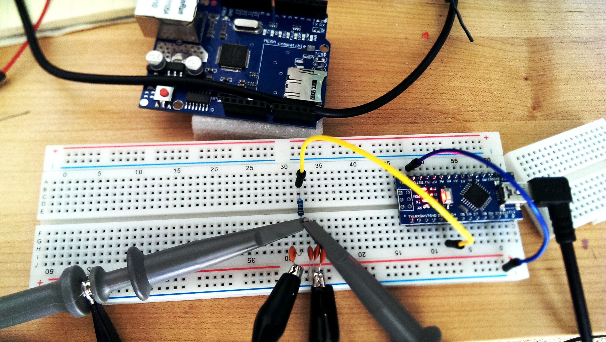
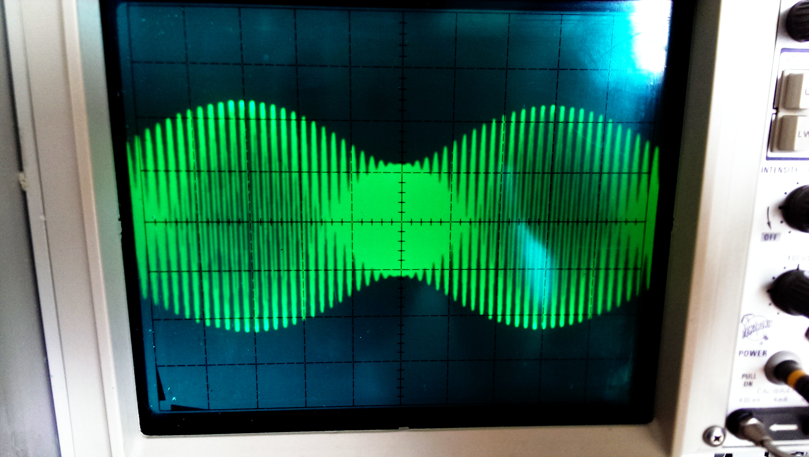
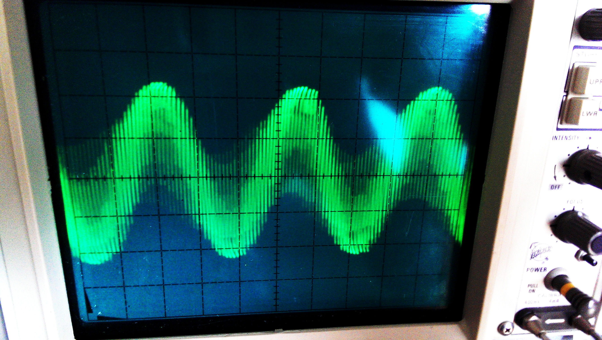
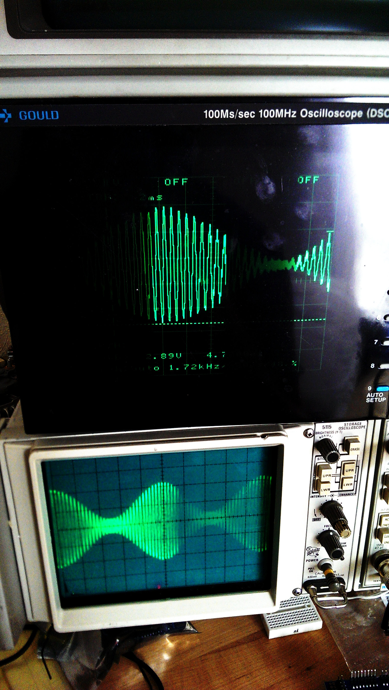
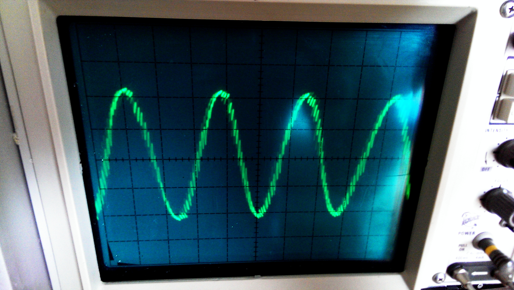
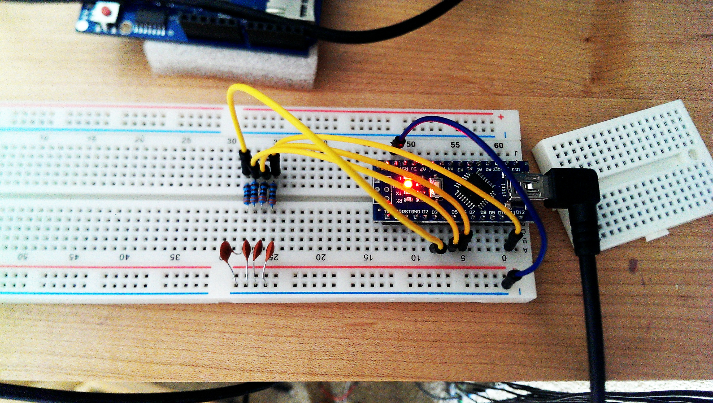
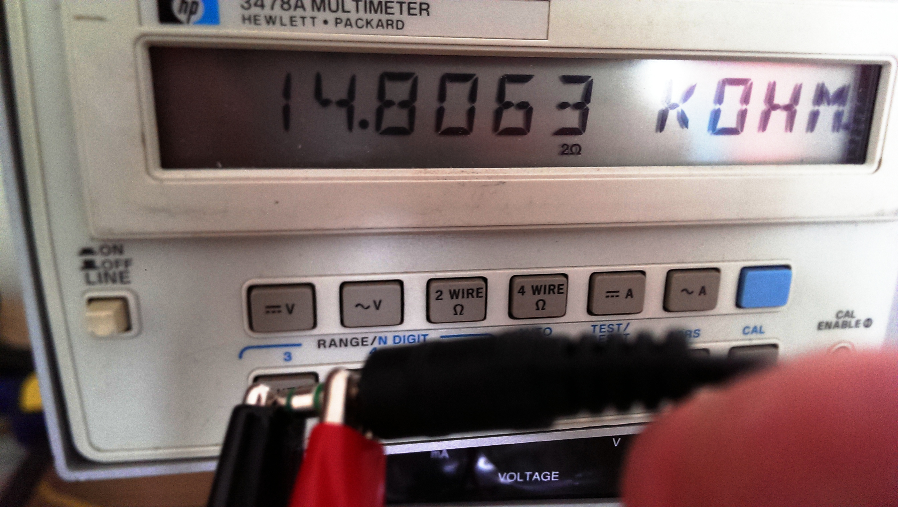
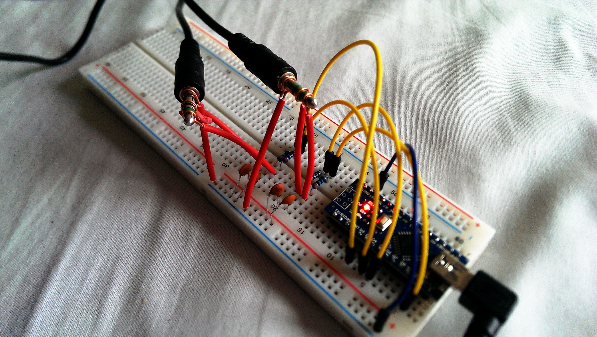

# Building an empirical kinetic model for human motion
A thoroughly misguided effort to tie accelerometer observations to real-world
movements. A better approach would have been to use multiple cameras and
chroma-keyed markers on joints, but the sonar implementation was a lot of fun
and gave me an excuse to acquire a bunch of phones.

## Part 1: Device testing
[Wes](https://github.com/weshenderson) and I built the Device Accelerator to
perform a series of tests on device sensors:


The goal was to obtain several pieces of information:

1. Accelerometer reporting range
2. Gyroscope reporting range
3. Magnetic compass reliability
4. Accelerometer sensitivity
5. Accelerometer impact behavior

Items 1, 2, and 3 were obtained from the Centrifuge Mode, in which we rotated
the device using a cordless drill. We were able to saturate the accelerometer
along two of three axes, most likely from a total force of between 10 and 20 gs:

```sh
$ nfu 0203-limit-test.gz -k '%2 eq "accel"' -f5. --splot %d
```


This Nexus device reported up to 40 m/s² along each axis, or about 4.2 gs. The
HTC One M7 reports up to 20 m/s² per axis, but at much greater sensitivity.

We found that the gravitational orientation was very stable under anything other
than extreme and prolonged acceleration:


We measured accelerometer sensitivity by unbalancing the centrifuge to be a
pendulum, then correlating orientation and lateral acceleration:


Resulting quantization was 0.0625 m/s², or about 0.0064 gs, for the coarser
Nexus device:


Finally, we wanted to see what would happen when the device was subjected to a
controlled impact. We clipped the device into the unbalanced centrifuge and let
the arm collide with a stop block, which produced the following accelerometer
behavior:

```sh
$ nfu 0203-impact.gz -k '%2 eq "accel"' -f5. --splot
```


All three axes were saturated at the moment of impact, and each individual
impact event contained a lot of rapid oscillation:

```sh
$ nfu 0203-impact.gz -k '%2 eq "accel"' -f35SD1sp %l
```


We repeated each impact three times from the same height, but the accelerometer
record differed slightly between each:


This means we probably can't recover the exact nature of an impact using
accelerometer data, though for the most part the accelerometer is highly
resilient and orientation is stable.

## Part 2: Super DIY sensor fusion
I wrote an app that continuously records sensor values at their maximum rate.
It produces gzipped TSV logs in this format, with about 150 rows/second on my
phone:

```
activity  position   sensor  timestamp       accuracy  x            y            z
sitting   left hand  accel   445820510469000 0         -0.22984336  7.699753     5.592855
sitting   left hand  gyro    445820510805000 3         -0.06352998  0.007330383  -0.02076942
sitting   left hand  grav    445820510805000 3         -0.22343627  7.884536     5.827053
```

Right now the goal is to extract as much information as humanly possible from
this stream, which means we can do some expensive feature extraction. We can
approximate later on for production.

### Feature extraction
There are two ways to do this, the lame way and the awesome way. The lame way
involves fusing the sensors by storing last-values and completing the tuples.
But I didn't export each sensor individually to tolerate that kind of crap.

So instead, we load everything into Octave and use cubic interpolation (to
ensure continuous derivatives, since this is a physical system), then re-emit
events at a fixed rate per unit time and with consistent timestamps. Timestamps
are nominally nanoseconds, but we end up converting everything to milliseconds
and emitting evenly-spaced 100 events/sec.

```sh
$ mkdir gen
$ fuse() {
    for f; do
      nfu $f -D1 --partition %2 \
        [ -f35. --octave "n2m = 1000000;         % nano -> milli
                          qms = 10;              % quantum in millis
                          xs(:, 1) /= n2m;       % convert to millis
                          xi = min(xs(:, 1)):qms:max(xs(:, 1));
                          xi = round(xi / qms) * qms;
                          xs = [xi', spline(xs(:, 1), xs(:, 2:4), xi)']" \
          --pipe "gzip > gen/${f%.gz}-{}.gz" ] > /dev/null

      nfu gen/${f%.gz}-accel.gz \
          -i0 gen/${f%.gz}-grav.gz \
          -i0 gen/${f%.gz}-gyro.gz \
          -i0 gen/${f%.gz}-magcal.gz \
        | gzip > gen/${f%.gz}-fused.gz
    done
  }
```

Now we need to do motion parsing. In particular, we want to convert from device
coordinates to real-world coordinates, something we can do by taking the gravity
vector into account. We then end up being able to represent local motion within
a horizontal plane. The plane can move vertically if the phone is being moved
along the gravitational axis.

We want to have some amount of consistency around the plane's orientation, which
we can do by using the magnetic sensor vector.

`X-rel.gz` will contain `timestamp ax ay az gx gy gz`, where acceleration is
oriented vertically according to gravity, and horizontally according to magnetic
north and east.

```sh
$ rel() {
    for f; do
      nfu $f --use geom.pl \
          -m 'my @grav = @_[4,5,6];
              my @mag  = @_[10,11,12];
              my @a    = vsub [@_[1,2,3]], \@grav;
              my @vert = proj \@a, \@grav;
              my @horz = vsub \@a, \@vert;
              my @v    = unit cross @grav, @mag;
              my @u    = unit cross @grav, @v;
              row %0, dot(\@u, \@horz), dot(\@v, \@horz), dot(\@a, [unit @grav]),
                      @_[7..12]' \
        | gzip > ${f%-fused.gz}-rel.gz
    done
  }

$ fuserel() {
    for f; do
      fuse $f
      rel gen/${f%.gz}-fused.gz
    done
  }
```

## Part 3: Physical modeling
Integrating accelerations should produce a velocity signal, but there's so much
drift that the results aren't useful by themselves. We need to use what we know
about accelerative context to fix up the integral as frequently as we can. We
can do this in a heuristic way, e.g. detecting walking specifically, but before
doing that I'd like to try to build a full physical model of human movement.
Doing this requires twelve phones and some masking tape:


We also need a sonar transmitter so each phone can report its physical location
relative to the others.

### Sonar strategy
We need each device to be able to locate itself quasi-continuously, ideally
registering both position and velocity. I bought two cheap sets of 5W computer
speakers to build a 3D sonar transmitter, and we can use four PWM outputs of an
Arduino Nano to provide synchronized audio signals (to within a few
microseconds, well below the sampling rate of a microphone). The phones can
then decode the mixed signals using short-time partial Fourier transforms and
compare the phase angles between transmitter points. The resulting data is a
series of quadratic difference equations that uniquely identifies the phone's
location in 3D space.

#### Modulation scheme
Android
[guarantees that 44100Hz sampling is available](http://developer.android.com/reference/android/media/AudioRecord.html),
which at 1126 ft/sec, means that a wave will travel 0.30639 inches between
audio samples. At 8 usable bits of audio precision, this means we have a
theoretical precision limit of about 1 thou; in practice, we can probably
expect a floor closer to 1/2" once we account for various imprecision and
sources of noise.

My first failed attempt to do this involved choosing multiple carrier
frequencies that AM-encoded the same location-sync wave. This leads to carrier
crosstalk. What we need instead is to choose a proper orthogonal basis. I
recommend reading about
[the DFT matrix](https://en.wikipedia.org/wiki/DFT_matrix) if this design
doesn't make sense.

Here's the big picture. We want a situation where we're taking a constant-size
window (in terms of #audio samples) that contains several oscillations of a
location signal wave modulated within a carrier. There's one such carrier/signal
pair for each of the three transmitters. The window size should capture an
integer multiple of each signal wave.

Design parameters:

- 2Hz minimum location update rate: at 44.1kHz sampling, this means we can have
  a 16384-sample window
- 20ft minimum wavelength at 1126ft/sec = 56.3Hz maximum signal frequency
- 56.3Hz * 16384/44100 = 20.917 oscillations per window; we can use 20, 19, and
  18, which correspond to 53.833Hz, 51.141Hz, and 48.450Hz, respectively
- Carriers should be phase-locked to their signals to provide additional angular
  information; at 48x signal, we have 2584Hz, 2454Hz, and 2325Hz, respectively

The carrier frequencies should be optimized to remain informative in the
presence of noise, which we do below.

#### Signal simulation
We need to measure angular detection sensitivity. First let's test on clean
signals. Lowest frequencies should have the highest error, so let's use those.

```octave
global tau   = 2 * pi;
global csfr  = 32;                                    % carrier/signal freq ratio
global fs    = [17, 18, 19, 20];
global ss    = fs * 44100 / 16384;                    % signals
global cs    = ss * csfr;                             % carriers
global t     = @(delta) (0:16383) / 44100 + delta;
global omega = @(delta) t(delta) * 2 * pi;

% encoders/decoders
e = @(k, dt) (1 + cos(ss(k) * omega(dt))) .* cos(cs(k) * omega(dt));
d = @(k, x)  angle(fft(abs(x .* exp(omega(0) * cs(k) * i)))(fs(k) + 1)) / \
             tau / ss(k);

ts = linspace(0, 0.01, 1000);

% definitions explained later, but here for convenience:
en = @(k, dt, snr) e(k, dt) + stdnormal_rnd(1, 16384) / (10 ** (snr / 10));
sig = @(dB, t1, t2, t3, t4) en(1, t1, dB) + en(2, t2, dB) + \
                            en(3, t3, dB) + en(4, t4, dB);

plot(ts, arrayfun(@(t) d(1, e(1, t)), ts) - ts)
```


Awesome, the timing error is constant over the entire 10ms range. Now let's set
the signal/noise level to 10dB (approximately; I'm not sure this math does
exactly that):

```octave
en = @(k, dt, snr) e(k, dt) + stdnormal_rnd(1, 16384) / (10 ** (snr / 10));
plot(ts, arrayfun(@(t) d(1, en(1, t, 10)), ts) - ts)
```


Now let's add multiple signals together and make sure we can unmix them. Using
an SNR of 20dB here (which is unrealistically low, but we're interested in
crosstalk specifically at this point):

```octave
sig = @(dB, t1, t2, t3, t4) en(1, t1, dB) + en(2, t2, dB) + \
                            en(3, t3, dB) + en(4, t4, dB);
plot(ts, arrayfun(@(t) d(1, sig(20, t, 0, 0, 0)), ts) - ts)
```


The absolute maximum timing error here is below 250μs. If we conservatively
assume it could be as high as 500μs (which it could be if we have noise), then
this means the carrier frequencies can be up to 2kHz and still provide usable
angular information. Right now we have 48x signal, at 2196.4, 2325.6, 2454.8,
and 2584.0. 2kHz means we can use a maximum of 37x, but 37x catches harmonics
from the 18 cycles/window signal wave (I figured this out empirically). We need
to use 32x to stay clear of harmonic interference.

#### Carrier phase
If we assume the signal wave is only accurate to 1/32 of a phase (about 500μs),
then we can fill in the difference using the carrier angle. The process
for this is actually quite easy:

```octave
function a = d2(k, x)
  global tau csfr fs ss cs omega
  cphase = angle(fft(x)(fs(k) * csfr + 1)) / tau;
  demod  = abs(x .* exp(omega(0) * cs(k) * i));
  sphase = angle(fft(demod)(fs(k) + 1)) / tau;

  % quantize and adjust
  t = round(sphase * csfr - cphase) / csfr + cphase / csfr;
  a = t / ss(k);
endfunction

plot(ts, arrayfun(@(t) d2(1, sig(30, t, 0, 0, 0)), ts) - ts)
```


We still maintain surprisingly good accuracy even when the SNR is down to 6dB
(the functional cutoff is about 3dB; beyond that there are a lot of error
spikes):

```octave
plot(ts, arrayfun(@(t) d2(1, sig(6, t, 0, 0, 0)), ts) - ts)
```


At 6dB most of the timing errors are below 1μs, which corresponds to about 10
thou. This is actually much better (~50x) than I expected.

As a brief aside, without the `- cphase` term inside the rounded quantity we get
systematic quantization errors:


The subtraction pushes the angle away from boundaries to minimize those
problems. (There may be a more robust way to do it, but this seems to work
pretty well.)

One last thing to check is that the algorithm reports consistent phases under
circular shifts:

```octave
plot(arrayfun(@(n) d2(1, circshift(sig(20, 0, 0, 0, 0), n)) \
                 - d2(2, circshift(sig(20, 0, 0, 0, 0), n)), 1:64:16384))
```


**TODO:** This is obviously wrong. Circular shifting should advance each
frequency by a different amount. We need a fifth sample-locking frequency to fix
the window to a common reference point.

### Converting sonar signals to real-world locations
Nothing we do on-device can be realtime due to various audio buffering delays,
GC pauses, etc. This means all we have are differential signals; that is, we can
measure the phase _difference_ between two signals, but not the _absolute_ phase
of any signal.

Fortunately this isn't a problem. Here's the basic setup. If we have three
transmitters at locations A, B, and C, then we get three observed pairwise
differences AB, AC, and BC. We're looking for the point X satisfying this (all
distances here are in terms of wavelength, so distance = time):

```
|A - X| - |B - X|           = AB
|A - X|           - |C - X| = AC
          |B - X| - |C - X| = BC
```

We can solve the system for the absolute distances `|A - X|`, `|B - X|`, and
`|C - X|`, at which point the problem reduces to a sphere intersection. We can
use [trilateration](https://en.wikipedia.org/wiki/Trilateration) to map back
into regular space.

(**NOTE:** The above is a lie. It's actually more complicated/fun; I explain why
in the section about the receiver algorithm.)

### Transmitter hardware design
We need a digital transmitter because it's so important that all of the signals
are precisely phase-aligned and have no relative drift. An Arduino Nano has
enough PWM outputs to drive four synchronized output channels, so I'll use one
for this.

Every consistent timing mechanism in the Arduino is based on a hardware timer,
of which the Arduino has three. Timers 0 and 2 are 8-bit and used for PWM;
timer 1 is 16 bits, which we'll need to track position within the 16384-sample
window. 16384 samples is 371.5ms, or about 5944308 clocks. Timer 1 overflows at
65536, so we'll need a prescale of at least 100. The lowest such setting is
256, which provides 62500 updates/second -- or almost exactly 23220 updates per
16384-sample window. We can configure timer 1 to overflow at 23220.

Arduinos are awesome, but they don't support hardware division. As a result,
division is basically off the table in any performance-critical context, which
this is. We can multiply two 16-bit numbers in 13 clock cycles, however, and
two 8-bit numbers in a single cycle. These limitations mean that we'll need to
do some planning to get the sine wave inputs right.

First, the Arduino only has 2KB of memory. We need a lookup table for sine
values, 512 in total, each expressed as a single byte, and we want these in
SRAM as opposed to Flash because access is 3x faster (one clock cycle vs
three). Numerically speaking, we want a process that maps each of the desired
frequencies into a number mod 512. Exact phase-correctness actually doesn't
matter here because the device sampling window is exactly the same size as the
generator's periodicity, and channel 1 has a compound signal that lets the
decoder adjust all of the phase angles.

Mapping out the math, where `t ∈ 0..23220`:

```
s1  = 17 cycles/window = t * 49132 >> 17
s1' = 21 cycles/window = t * 60693 >> 17

s2  = 18 cycles/window = t * 52022 >> 17
s3  = 19 cycles/window = t * 54913 >> 17
s4  = 20 cycles/window = t * 57803 >> 17
```

The math here, by the way:

```octave
(2 ** 26) * 21 / 23220           % 2 ** 26 = 512 * 2 ** 17, hence >> 17 above
```

The carriers, each of which is exactly 32x the signal, are the same but shifted
by just 12 bits instead of 17.

#### Digital modulation
The sine table contains one signed byte per entry; that is,
`floor(127 * sin(x))`, stored as an integer (where `x = θ / 512 * tau`). Arduino
PWM pins use unsigned bytes, so writing a modulated value looks like this:

```cpp
PWM = (char) ((unsigned char) (128 + sin1) * sin2 >> 8) + 128;
```

#### Output filtering
I'm reluctant to wire the output pins directly to the speaker inputs for two
reasons. First, any momentary shorts might fry the Arduino; and second, we'd be
relying on the speakers to provide antialiasing (which is probably a safe bet,
but it's still better to be thorough about it). The simplest way to fix all of
this is to use a lowpass RC filter tuned to something around 20kHz. This
addresses the shorting problem as well, as long as we choose a resistance value
of at least 500Ω or so. Connection-wise, we want this:

```
arduino PWM 1 --R1--+-------> speaker out 1
                    |
                    C1 -----> ground

arduino PWM 2 --R2--+-------> speaker out 2
                    |
                    C2 -----> ground
...
```

The cutoff frequency is `1 / (tau * R * C)`. It's tempting to use a really
small capacitor and a large resistor, but the speaker's input impedance is most
likely 600Ω (**NB:** untrue; 14kΩ when I measured it) -- so we can't underpower
it too much. Realistically we should stick to resistors in the 1-2kΩ range,
putting the capacitor at 4nF for 20kHz exactly. We can use 6.8nF (more common
than 4nF) and a moderately lower resistance.

#### Arduino PWM setup
We're using timer 1 prescaled at 256 clocks/tick to advance through the window,
which leaves timers 0 and 2 for PWM control. We want to decrease the prescaler
to 1 for each to set the update rate above the 44.1kHz output frequency. Note
that we lose real-world timing ability because we're cannibalizing timer 0. This
is also why we clear interrupts.

(By the way, you can find the timer register to pin mappings in the
[Arduino source](https://github.com/arduino/Arduino/blob/88650b65a699dcddbe0ac58bbabd9b19cf882c1e/hardware/arduino/avr/variants/standard/pins_arduino.h#L178).)

```
digital pin 3  -> timer 2B
digital pin 5  -> timer 0B
digital pin 6  -> timer 0A
digital pin 11 -> timer 2A
```

```cpp
void setup()
{
  cli();

  // Let the arduino library do most of the pin configuration; then tweak
  // prescalers and overflow registers.
  pinMode(3,  OUTPUT);
  pinMode(5,  OUTPUT);
  pinMode(6,  OUTPUT);
  pinMode(11, OUTPUT);

  // Fix up the prescalers, clear interrupts
  TCCR0A = TCCR2A = 1 << COM2A1 | 1 << COM2B1 | 1 << WGM21 | 1 << WGM20;
  TCCR0B = TCCR2B = 1 << CS10;

  // Now get timer 1 set up correctly, with early overflow and 256x prescaling.
  TCCR1A = 0;
  TCCR1B = 1 << WGM12 | 1 << CS12;
  OCR1A  = 23220;
}
```

#### Main loop
Now that we've got the timers set up correctly, we need a loop that, as fast as
humanly possible, digitally modulates the sine waves and writes to the PWM
overflow registers. Nothing about the loop needs to be exactly
clock-synchronized because we're basing everything on the hardware timer -- but
more samples more quickly is always better.

Also note that we use `for (;;) {...}` rather than relying on `loop()` to repeat
the code. Individual clock cycles matter here (there are 362.81 clock cycles per
44.1kHz sample), so we want to avoid the function call overhead.

Before writing any code, let's generate the sine table:

```sh
$ nfu n:512 -m 'int(127 * cos((%0 - 1) / 512 * 2 * pi))' --fold 1 \
            -m '"int8_t cosine[] = {" . join(",", @_) . "};"'
```

```cpp
// generated by the above nfu command
int8_t cosine[] = {127,126,126,126,126,126,126,126,126,126,126,125,125,125,125,124,124,124,123,123,123,122,122,121,121,121,120,120,119,119,118,117,117,116,116,115,114,114,113,112,112,111,110,109,108,108,107,106,105,104,103,102,102,101,100,99,98,97,96,95,94,93,91,90,89,88,87,86,85,84,82,81,80,79,78,76,75,74,73,71,70,69,67,66,65,63,62,61,59,58,57,55,54,52,51,50,48,47,45,44,42,41,39,38,36,35,33,32,30,29,27,26,24,23,21,20,18,17,15,13,12,10,9,7,6,4,3,1,0,-1,-3,-4,-6,-7,-9,-10,-12,-13,-15,-17,-18,-20,-21,-23,-24,-26,-27,-29,-30,-32,-33,-35,-36,-38,-39,-41,-42,-44,-45,-47,-48,-50,-51,-52,-54,-55,-57,-58,-59,-61,-62,-63,-65,-66,-67,-69,-70,-71,-73,-74,-75,-76,-78,-79,-80,-81,-82,-84,-85,-86,-87,-88,-89,-90,-91,-93,-94,-95,-96,-97,-98,-99,-100,-101,-102,-102,-103,-104,-105,-106,-107,-108,-108,-109,-110,-111,-112,-112,-113,-114,-114,-115,-116,-116,-117,-117,-118,-119,-119,-120,-120,-121,-121,-121,-122,-122,-123,-123,-123,-124,-124,-124,-125,-125,-125,-125,-126,-126,-126,-126,-126,-126,-126,-126,-126,-126,-127,-126,-126,-126,-126,-126,-126,-126,-126,-126,-126,-125,-125,-125,-125,-124,-124,-124,-123,-123,-123,-122,-122,-121,-121,-121,-120,-120,-119,-119,-118,-117,-117,-116,-116,-115,-114,-114,-113,-112,-112,-111,-110,-109,-108,-108,-107,-106,-105,-104,-103,-102,-102,-101,-100,-99,-98,-97,-96,-95,-94,-93,-91,-90,-89,-88,-87,-86,-85,-84,-82,-81,-80,-79,-78,-76,-75,-74,-73,-71,-70,-69,-67,-66,-65,-63,-62,-61,-59,-58,-57,-55,-54,-52,-51,-50,-48,-47,-45,-44,-42,-41,-39,-38,-36,-35,-33,-32,-30,-29,-27,-26,-24,-23,-21,-20,-18,-17,-15,-13,-12,-10,-9,-7,-6,-4,-3,-1,0,1,3,4,6,7,9,10,12,13,15,17,18,20,21,23,24,26,27,29,30,32,33,35,36,38,39,41,42,44,45,47,48,50,51,52,54,55,57,58,59,61,62,63,65,66,67,69,70,71,73,74,75,76,78,79,80,81,82,84,85,86,87,88,89,90,91,93,94,95,96,97,98,99,100,101,102,102,103,104,105,106,107,108,108,109,110,111,112,112,113,114,114,115,116,116,117,117,118,119,119,120,120,121,121,121,122,122,123,123,123,124,124,124,125,125,125,125,126,126,126,126,126,126,126,126,126,126};

#define cosine(x)      cosine[(x) & 0x1ff]
#define modulate(a, b) (char) ((128 + (int) (a)) * (char) (b) >> 8)

void loop()
{
  for (;;)
  {
    // Record current time
    uint16_t t = TCNT1;

    // Convert to phase-space for each signal + carrier.
    uint32_t f1a = t * 49132ul;
    uint32_t f1b = t * 60693ul;
    uint32_t f2  = t * 52022ul;
    uint32_t f3  = t * 54913ul;
    uint32_t f4  = t * 57803ul;

    // Buffer output values to minimize phase shift between channels.
    uint8_t c1 = (modulate(cosine(f1a >> 17), cosine(f1a >> 12)) >> 1)
               + (modulate(cosine(f1b >> 17), cosine(f1b >> 12)) >> 1)
               + 128;
    uint8_t c2 = modulate(cosine(f2 >> 17), cosine(f2 >> 12)) + 128;
    uint8_t c3 = modulate(cosine(f3 >> 17), cosine(f3 >> 12)) + 128;
    uint8_t c4 = modulate(cosine(f4 >> 17), cosine(f4 >> 12)) + 128;

    // 250ns max pairwise phase difference
    OCR2B = c1; OCR0B = c2;
    OCR0A = c3; OCR2A = c4;
  }
}
```

250ns at 1126ft/sec is about 3 thou, well beyond our decoding accuracy. It won't
matter anyway, though, because we'll calibrate the positioning system for
default phase differences.

#### Hardware assembly
The testing setup was straightforward. I took an Arduino Nano with pin headers
and set up a 1kΩ/6.8nF output filter like this:



Once I fixed some bugs in the software, I got this waveform:



The modulated wave wasn't coming in very clearly; here's the detail of the
carrier:



The problem was that the lowpass filter wasn't being aggressive enough (as [Kurt](https://github.com/kurtstoll)
had suspected would happen). Replacing the 1kΩ with a 3.3kΩ resistor fixed it:





The final assembly with all four channels and 3.3kΩ resistors (the outputs are
on the capacitor-sides of the resistors):



All that's left is to wire up the speakers. First I made sure the input
impedance was sufficiently high:



Then created some super hi-fi connectors and plugged them into the breadboard:



And that's it! The sonar transmitter emitted one of the worst sounds I've ever
heard in my life. Success.

### Sonar receiver
The very first thing to do is crank the transmitter volume up a bit and do some
microphone testing. If we can't get enough signal from the microphone, then all
of this will be for naught. I set the transmitter to about 20% volume and walked
around a room holding the device, ranging between 3 and 8 feet away from the
speakers. Here's a profile of the resulting wav:


The important thing is to look at the signal levels in the spectrum analysis. I
took a quiet range from the signal above and got this:


This is awesome: well over 10dB SNR across the whole spectrum, and almost no
noise within the carrier range. We should be able to get some insane accuracy
from this setup.

#### Trilateration math
Earlier I suggested that we could solve a system of linear equations to get
absolute distances, but unfortunately I was completely wrong:

```octave
octave:8> inv([1, -1, 0; 1, 0, -1; 0, 1, -1])
warning: inverse: matrix singular to machine precision, rcond = 0
ans =

   Inf   Inf   Inf
   Inf   Inf   Inf
   Inf   Inf   Inf
```

(In hindsight I should have expected this; it seemed a little too easy.)

Ok, so starting over. We're going to need all four transmitters, arranged such
that they aren't coplanar. The math is more complicated than I care to solve
algebraically, but luckily computer scientists have been willing to put
mathematicians out of jobs by writing numerical solvers. We'll use one of those.

[Papers about this problem](https://web.archive.org/web/20110719232148/http://www.macalester.edu/~halverson/math36/GPS.pdf)
typically solve for four parameters: the receiver position (x, y, z) and
receiver clock value -- that is, the absolute transmitter clock relative to the
receiver. This is actually fortuitous, as it gives us a way to precisely fix up
the receiver clock to within the margin of error provided by their default
synchronization. (And the margin of error here is on the order of microseconds.)

Implementation-wise, the simplest strategy is probably just to use
[Apache Commons Math's conjugate gradient optimizer](http://commons.apache.org/proper/commons-math/apidocs/org/apache/commons/math3/optimization/general/NonLinearConjugateGradientOptimizer.html),
which can be applied straight to the four summed constraint equations after
squaring the errors. The equations are then solved when the sum hits zero.

#### Decoding logic
There are FFT libraries for Java, but we don't actually need a complete spectrum
to get what we want. We can decode the signal just by picking out the four
carriers, and demodulating each from there. This involves computing 10 complex
dot products, which we can inline like this:

```java
for (int i = 0; i < 16384; ++i) {
  double x = samples[i] / 32768.0;
  double re, im, d;

  // Dot product element for carrier
  c1r += re = x * cos[i * 17 * 32 & 0x3fff];
  c1i += im = x * sin[i * 17 * 32 & 0x3fff];

  // Demodulate this element inline to save memory
  d = dist(re, im);
  s1r += d * cos[i * 17 & 0x3fff];
  s1i += d * sin[i * 17 & 0x3fff];

  // (same thing for signals 2, 3, and 4)
}
```

At this point the carrier phase is an atan of `c1r` and `c1i`, and the signal
phase is in `s1r` and `s1i`.

#### Phase correction
Signal 1 has two superimposed frequencies, one at 17 cycles/window and one at 21
cycles/window. These numbers are relatively prime, so the combined phase angles
uniquely identify our sampling offset within the signal window. Our goal is to
find this offset and then adjust the phases of the other signals accordingly, so
we're always measuring them from the same transmitter-reference position.

Another benefit of knowing the window offset is that it provides time
synchronization within ~375ms boundaries (and the phones' NTP synchronization
probably covers us down to that much).

Ok, anyway. We've got these two phase offsets, φa and φb, for the 17 and 21
cycle/window signals, respectively. We know that they both start at zero when
the window begins. Visually, here's how they relate through a circular window
shift (color is time, φa on the X axis, φb on Y):

```sh
$ nfu n:16384 -m 'row %0 / 16384 * 17, %0 / 16384 * 21' \
              -nm 'row %1 - int(%1), %2 - int(%2), %0 / 16384' \
              -p '%d lc palette'
```


If we want the time, the simplest strategy is probably to find the Y intercept
of whichever line we're on, do a modular division, and then add the slope part
back in. It's easier if y0 is expressed as an integer between 0 and 17:

```
y = (21/17)x + y0/17  -->  y0 = 17(y - (21/17)x)
                              = 17(φb - (21/17)φa)
                              = (17φb - 21φa) unsigned-mod 17
```

Testing our logic:

```sh
$ nfu n:16384 -m 'row (%0 - 1) / 16384' \
              -m 'row %0, %0 * 17, %0 * 21' \
              -m 'row %0, %1 - int %1, %2 - int %2' \
              -m 'my $y0 = int(17 * %2 - 21 * %1 + 0.5 + 21*17) % 17;
                  my @div = (0) x 17;
                  $div[$_ * 21 % 17] = $_ for 0..16;
                  my $t  = ($div[$y0] + %1) / 17;
                  row %0 - $t' \
              -oc
1687    -2.88657986402541e-15
13011   0
1686    2.88657986402541e-15
```

Booyah. Here's what the code looks like in Java:

```java
static final int[] div17 = new int[17];
static {
  for (int i = 0; i < div17.length; ++i) div17[i * 21 % 17] = i;
}
```

```java
final double cphase1 = Math.atan2(c1i, c1r) / tau;
final double cphases = Math.atan2(csi, csr) / tau;
final double sphase1 = Math.atan2(s1i, s1r) / tau;
final double sphases = Math.atan2(ssi, ssr) / tau;
final double phiA =
  (Math.round(sphase1 * 32 - cphase1) / 32.0 + cphase1 / 32 + 1) % 1.0;
final double phiB =
  (Math.round(sphases * 32 - cphases) / 32.0 + cphases / 32 + 1) % 1.0;

final int    y0 = ((int) Math.round(17 * phiB - 21 * phiA) + 21*17) % 17;
final double t  = (div17[y0] + phiA) / 17.0;
```

Now that we have the most likely window shift time, we can subtract it from the
phases of channels 2, 3, and 4:

```java
final double cphase2 = (Math.atan2(c2i, c2r) / tau - t * 18 * 32) % 1.0;
final double cphase3 = (Math.atan2(c3i, c3r) / tau - t * 19 * 32) % 1.0;
final double cphase4 = (Math.atan2(c4i, c4r) / tau - t * 20 * 32) % 1.0;

final double sphase2 = (Math.atan2(s2i, s2r) / tau - t * 18) % 1.0;
final double sphase3 = (Math.atan2(s3i, s3r) / tau - t * 19) % 1.0;
final double sphase4 = (Math.atan2(s4i, s4r) / tau - t * 20) % 1.0;
```

Note that these phases are implicitly differential at this point. Now we just
need to do the same carrier/signal phase detection we did for channel 1:

```java
final double phiT = 16384 / 44100.0;
t2 = (Math.round(sphase2 * 32 - cphase2) / 32.0 + cphase2 / 32) / 18 * phiT;
t3 = (Math.round(sphase3 * 32 - cphase3) / 32.0 + cphase3 / 32) / 19 * phiT;
t4 = (Math.round(sphase4 * 32 - cphase4) / 32.0 + cphase4 / 32) / 20 * phiT;
```

**TODO:** The basic values are stable, but we're getting a lot of wrapping
errors.

## Failed experiments, kept for posterity
#### Before phase correction
I'm not a smart person. The situation in my head was this: you have four sine
waves, each a different frequency. If you observe a time slice equal to the
joint periodicity, the phase differences will tell you the relative time offsets
between the signals.

Of course, this isn't remotely true. The moment you pick up a circular shift of
the original signal you're going to start observing phase shifts. In other
words, **the apparent relative phases of the signals vary over time.** (The
worst part about this is that I managed to convince myself otherwise both
intuitively, and then by a broken simulation.)

Luckily this is fixable. We just need one of the signals to contain a second
frequency that gives the decoder enough information to figure out the absolute
time shift and correct accordingly. This is what the 21Hz signal is about.

#### Modulation scheme (original with doubled frequencies)
Android
[guarantees that 44100Hz sampling is available](http://developer.android.com/reference/android/media/AudioRecord.html),
so ideally we want carrier frequencies that evenly divide that. We need a total
of four noninterfering carriers that can decoded using wavelets; trivially we
can do this by using 1x, 2x, 4x, and 8x a base frequency:

```sh
$ irb
> [256, 128, 64, 32].map {|x| 44100.0 / x}
[172.265625, 344.53125, 689.0625, 1378.125]
> 44100.0 / 2048           # calculate sync wave frequency
21.533203125
```

We then use AM to encode the same low-frequency location signal within each
carrier. For example:

```sh
$ nfu n:44100 -m '%0 / 44100' \
      -m 'my $loc = sin %0 * 23.533203125 * 2 * pi;
          row %0,
                  $loc * sin(%0 * 172.265625 * 2 * pi),
              3 + $loc * sin(%0 * 344.53125  * 2 * pi),
              6 + $loc * sin(%0 * 689.0625   * 2 * pi),
              9 + $loc * sin(%0 * 1378.125   * 2 * pi)' \
      --mplot '%u1:2 %l%t"172Hz carrier";
               %u1:3 %l%t"344Hz carrier";
               %u1:4 %l%t"689Hz carrier";
               %u1:5 %l%t"1378Hz carrier"'
```


The phone uses a fast wavelet transform to extract each carrier frequency
individually, demodulating the location wave for each in the process. We can
simulate the process in Octave, first by generating the combined signal:

```octave
function xs = encode(carrierHz, msDelay)
  t = linspace(0, 1, 44100) + msDelay / 1000;
  loc = 1 + cos(t * 23.533203125 * 2 * pi);
  carrier = cos(t * carrierHz * 2 * pi);
  xs = loc .* carrier;
endfunction

function ms = decode(wave, carrierHz)
  t = (0:columns(wave) - 1) ./ 44100;
  demod = abs(wave .* exp(t * carrierHz * 2 * pi * i));
  ms = -angle(dot(demod, exp(t * 23.533203125 * 2 * pi * i))) \
       / (2 * pi) / 23.533203125 * 1000;
endfunction
```

Two quick tests to make sure this works correctly. First, check functioning on a
clean signal:

```octave
plot(-20:0.02:20, arrayfun(@(ms) decode(encode(1378.125, ms)(1:2048), 1378.125),
                           -20:0.02:20) - (-20:0.02:20), '-',
     -20:0.02:20, arrayfun(@(ms) decode(encode(1378.125, ms)(1:4096), 1378.125),
                           -20:0.02:20) - (-20:0.02:20), '-',
     -20:0.02:20, arrayfun(@(ms) decode(encode(1378.125, ms)(1:8192), 1378.125),
                           -20:0.02:20) - (-20:0.02:20), '-',
     -20:0.02:20, arrayfun(@(ms) decode(encode(1378.125, ms)(1:16384), 1378.125),
                           -20:0.02:20) - (-20:0.02:20), '-')
legend('1x sync', '2x sync', '4x sync', '8x sync')
```


The temporal resolution here is actually pretty egregious. 1ms = 1 foot.
