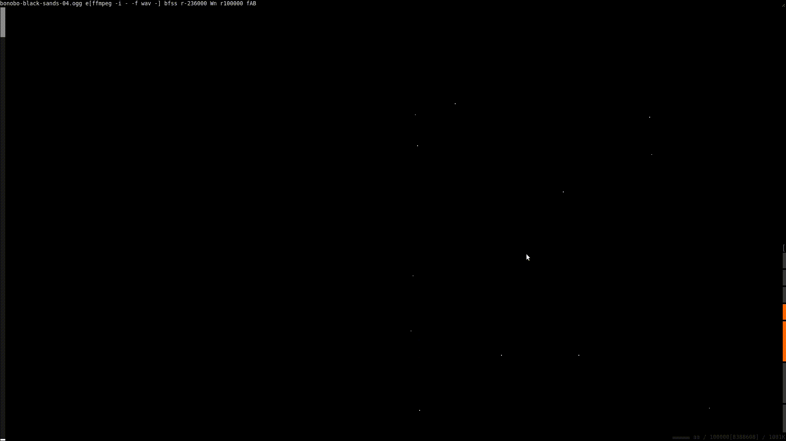
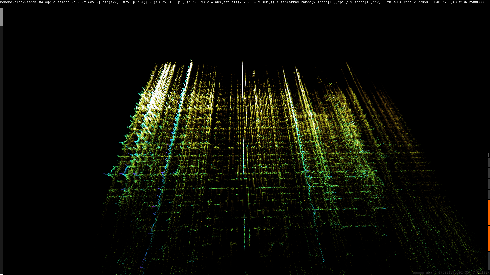

# Using ni to visualize audio files
I wrote the [binary interfacing for
ni](https://github.com/spencertipping/ni/blob/develop/doc/binary.md#binary-decoding)
with the intention of doing signal processing, but until recently I haven't
used it much. This weekend I decided to try some spectral visualizations for
audio. Here's Bonobo's Black Sands album, log-frequency FFT at every
quarter-second:


## Things you'll need to install if you want to do this
1. [ni](https://github.com/spencertipping/ni), which is just one script with no
   dependencies.
2. NumPy (`apt install python-numpy` on Ubuntu)
3. `ffmpeg` (`apt install ffmpeg`)

## Taking a look at some audio sample data
Before we get into anything too heavy, let's figure out how to access the sample
data from the audio. There are three steps involved:

1. Use `ffmpeg` to stream from Vorbis to WAV
2. Use ni's `bf` operator to unpack unsigned short stereo samples (`bf'ss'`)
3. Seek to the end of silence, about 236000 samples in


This is almost the right format for `ni --js`. The only thing we need to do is
prepend the sample index using the left-column-juxtapose operator `W` and the
stream `n` (an infinite stream of ascending integers). I'm also truncating the
input data (`r100000`) and limiting it to just the left channel to keep it
two-dimensional (`fAB` -- we've dropped field `C`). Here's the command:

```
bonobo-black-sands-04.ogg e[ffmpeg -i - -f wav -] bfss r-236000 Wn r100000 fAB
```

Note that file paths are relative to wherever `ni --js` is running. I started it
from the same terminal I had open to look at the samples.

The data's bounds are larger than `ni --js` is configured for by default, so we
increase the view distance to zoom out.



## Collecting sample windows
The next order of business is to break the audio into windows, each one second
long and spaced 1/4 second apart. The overlap is deliberate; later on we'll
multiply by a Hann window to attenuate the edges.

Right now the sample data is a vertical stream:

```
1  left1  right1
2  left2  right2
...
```

Our windowed data structure will look a little different. First, let's stick to
just a single channel -- in this case the left one. Second, we want one window
per line, each prefixed with its time offset:

```
0     left1      left2      left3     ... left44100
0.25  left11026  left11027  left11028 ... left55125
...
```

We can build this up from the wav binary by changing the `bf` template to unpack
11025 left-samples at a time (`bf'(sx2)11025'`) and then using nondestructive
readahead ("peek lines", `pl(n)`) in a perl mapper context. Perl defines `$.` as
the current line number, so we can prepend the window timestamps in the same
step. I subtract three from it because ni advances perl's internal line counter
when we peek lines.

Note that I skip the first window (`r-1`, "drop one row") because it contains
WAV header data. This means our first window begins just before 0.25 seconds.


Here's the code we have so far:

```sh
$ ni bonobo-black-sands-04.ogg \
     e[ffmpeg -i - -f wav -] \
     bf'(sx2)11025' \
     p'r +($.-3)*0.25, $_, pl(3)' \
     r-1
```

## Visualizing our windows
As it stands, we have too many dimensions for `ni --js` to use. We'll need to
convert our windows to a series of `x y z` points, one per audio sample. Here's
how we want our coordinates to be mapped:

```
             x=1        x=2        x=3   ...
time1=z  sample1=y  sample2=y  sample3=z ...
time2=z  sample1=y  sample2=y  ...
...
```

...and here's the output we want:

```
x  y        z
1  sample1  time1
2  sample2  time1
3  sample3  time1
...
1  sample1  time2
2  sample2  time2
...
```

This is a form of dense-to-sparse matrix conversion, which is a fairly common
problem; ni has an operator to do most of the work for us. If we treat each row
as a separate Nx1 matrix, we can use `Y` (dense -> sparse) to emit one row per
cell. Those rows will look like this:

```
time1  0  0  sample1
time1  0  1  sample2
time1  0  2  sample3
...
time2  0  0  sample1
time2  0  1  sample2
...
```

From there, we can depth-stack by using `fCDA` to set the correct axes. Here's
our command so far:

```sh
$ ni bonobo-black-sands-04.ogg \
     e[ffmpeg -i - -f wav -] \
     bf'(sx2)11025' \
     p'r +($.-3)*0.25, F_, pl(3)' \
     r-1 YB fCDA
```

...and here's a URL that sets up the view state:

```
http://localhost:8090/#%7B%22ni%22:%22bonobo-black-sands-04.ogg%20e%5Bffmpeg%20-i%20-%20-f%20wav%20-%5D%20bf'(sx2)11025'%20p'r%20+($.-3)*0.25,%20F_,%20pl(3)'%20r-1%20YB%20fCDA%20r5000000%22,%22v%22:%7B%22br%22:8.758284040740838,%22ot%22:%5B-14970.296371687125,10463.88508344731,-5.065896788535407%5D,%22os%22:%5B0.7788007830714045,0.1737739434504448,18958.354802043963%5D,%22sa%22:0.03,%22cr%22:%5B43.6666666666666,-20.333333333333357%5D,%22cd%22:12396.5090779824,%22axes%22:%5B0,1,2,3%5D%7D%7D
```


It's also possible to use the sparse representation to vertically stack the
waveforms. Instead of producing a three-column output, we add `65536*z` to `y`:


## Applying an FFT using `N`
This is where we pull in NumPy, which provides an FFT function. ni's `N`
operator runs a series of matrices through a NumPy context. If provided, its
column spec indicates the first column of matrix data (everything to the left is
treated as the matrix partition and is preserved).

We can get a simple FFT by transforming each window like this:

```
NB'x = abs(fft.fft(x))'
```

This is a good opportunity to normalize the window vectors to sum to 1; this way
we don't have enormous FFT components.

```
NB'x = abs(fft.fft(x / x.sum()))
```


We should do a few things to these FFTs:

1. Drop the top half; it's just a mirror image (`rp'a < 22050'`)
2. Rescale the spectrum so the low-frequency range is larger (`,LA`)
3. Log-scale the amplitudes (`,LB`)
4. Apply a Hann window to each FFT input
   (`x * sin(array(range(x.shape[1]))*pi / x.shape[1])**2`)

`,L` is a cell-level operator that takes the unsigned log of a number. Here's
what we have in the command bar so far:

```
bonobo-black-sands-04.ogg e[ffmpeg -i - -f wav -]
  bf'(sx2)11025' p'r +($.-3)*0.25, F_, pl(3)' r-1
  NB'x = abs(fft.fft(x / (1 + x.sum()) * sin(array(range(x.shape[1]))*pi / x.shape[1])**2))'
  YB fCDA rp'a < 22050' ,LAB p'r a, b + c*30'
  r5000000
```

The final `r5000000` just cuts the datastream after a while so interaction is
faster. Without it, the backend ni process can outrun Chrome's websocket driver,
which causes the browser to become unusably slow while data is being streamed.


## Improving the presentation
**TODO:** explain this part better

We need two new steps: `rxB` to copy each row as many times as the value in
column `B` (amplitude), and `,AB` to randomly attenuate the resulting copied
amplitudes by an exponentially-distributed value. This creates a shadow
downwards from the largest values.


This transform has the secondary benefit of removing the zero points, which
makes it easier to see the data we care about.

### Stacking back into 3D and mapping color
Almost done. Let's remove the `p'r a, b + c*30'` we had to vertically stack the
FFTs; now we're back to three dimensions. I swapped X and Z so X corresponds to
time and Z to log(frequency), so we have this:


The last thing we want is to add color, which we can do just by setting the axis
mapping to `ABCB` (copying Y into the chroma channel). I'm also copying Y into
the opacity channel, so we really have `ABCBB`.



## Final notes: scaling it out
Right now everything's running in a single stream and we're making fairly
uneven use of our processors. If we want to process an album's worth of sound
data, we should parallelize the expensive parts -- in this case, everything
downstream of our window assembly.

I'm also going to change the exponential distribution for `,AB` by appending
`8`: this produces a much sharper curve.

I have more processors on `r1` than I have locally, so here's my pipeline
structure:

```
bonobo-black-sands-04.ogg               # send data still compressed
  sr1[
    e[ffmpeg -i - -f wav -]             # ffmpeg on the server
    bf'(sx2)11025' p'r +($.-3)*0.25, F_, pl(3)' r-1
    S24[                                # everything from here is splittable
      NB'x = abs(fft.fft(x / (1 + x.sum()) * sin(array(range(x.shape[1]))*pi / x.shape[1])**2))'
      YB fCDA rp'a < 22050' ,LAB rxB ,AB fCBA]]
```


