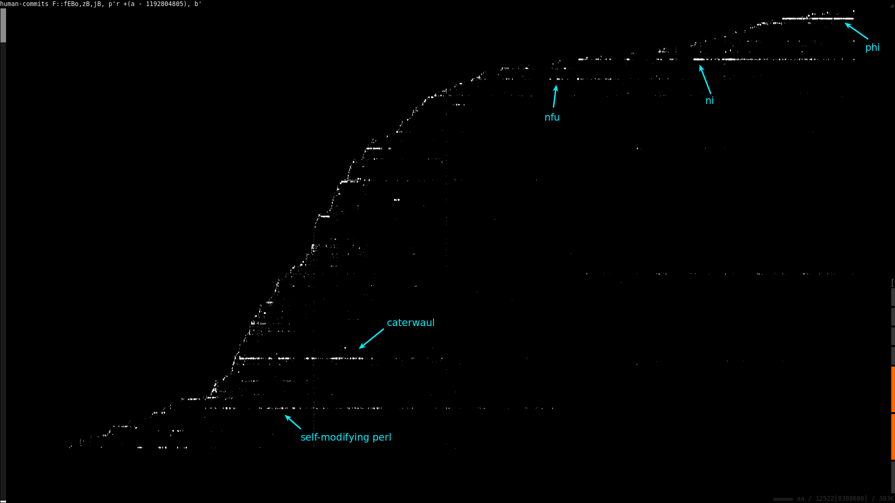

# The Commit Roundup
As a Lisp fan, I'm a proponent of the general idea that code is data -- and
what better (and less subtle) way to make that point than to take a decade of
open source commits and process it like a dataset?


## First things first: let's find projects and collect commits
This is just for open-source stuff that I've actually pushed to github. I'm also
running this stuff on the server (`sr2[...]`) against a fairly current home
directory backup; that's faster than doing it locally.

```sh
$ ni sr2[e[find /mnt/v1/st/spencertipping/{initiative,structure} \
               -xdev -name .git -type d] \
         rp'grep !/HEAD/, <$_/refs/remotes/*/*>' \
         rp'!system "grep -q git\@github.com: $_/config"'] \
     z:all-projects e'wc -l'
169
```

Let's collect the commit log from each one for all branches and tags. `git://`
lists out all branches/tags per repo; then I take the resulting `gitcommit://`
URIs and change them to `githistory://` to get a full commit history for each
one.

```sh
$ ni all-projects p'"git://$_"' \
     sr2[\<fA ps/gitcommit:/githistory:/r \
         ^{scale/ibuf=256} S16\<rp'b =~ /spencer/i' guz] \
     :all-commits e'wc -l'
11549
```


### Filtering out non-human and duplicated commits
Some of these aren't real; they're stuff that gets auto-committed, duplicate
commits across multiple checkouts of the same project, or other non-human
contributions. I can find those by looking for anything with a bunch of
identical commit messages but different commit IDs:

```sh
$ ni all-commits F::fCG.gufB. F^::gcO
74      Updated from parents            # duplicate
45      Updated from object             # duplicate
40      Update from parents             # duplicate
32      WIP                             # legit
32      Minor changes                   # legit
25      Oops                            # very legit
24      New post                        # legit
20      Minor fixes                     # legit
18      Merge branch 'develop' of github.com:spencertipping/ni into develop
13      Updated caterwaul               # legit
13      Updated README                  # legit
13      More design                     # legit
13      Merged                          # probably duplicate
12      Maybe fix                       # legit
12      Aha, fixed it                   # legit
11      Updated                         # not sure
11      Rebuilt                         # duplicate
11      Maybe                           # legit
10      chmod                           # legit (should be empty)
...
```

Ok that's not too bad. Let's go ahead and make the exclusion list so we can
remove the auto/duplicate commits:

```sh
$ cat >ignore-messages <<EOF
update
Updated from parents
WIP
Update from parents
Updated from object
Merge branch 'develop' of github.com:spencertipping/ni into develop
Merged
Rebuilt
EOF

# make sure we got them:
$ ni all-commits e'wc -l'
11549
$ ni all-commits rIDignore-messages z:human-commits e'wc -l'
11312         # looks about right
```


## Projects and timelines
First, top projects by commit volume (just my commits; ni has more than phi if
you count other contributors):

```sh
$ ni human-commits F::fBgcO
1862    ///mnt/v1/st/spencertipping/initiative/phi
1644    ///mnt/v1/st/spencertipping/initiative/ni
1617    ///mnt/v1/st/spencertipping/initiative/caterwaul
699     ///mnt/v1/st/spencertipping/initiative/perl-objects
358     ///mnt/v1/st/spencertipping/initiative/nfu
305     ///mnt/v1/st/spencertipping/initiative/canard
254     ///mnt/v1/st/spencertipping/initiative/cheloniidae
...
```

Let's sort by UNIX epoch and visualize project contributions over time. I expect
the map to converge over the years as I've become better at finishing stuff, but
let's see if that's true:



```
http://localhost:8090/#%7B%22ni%22:%22human-commits%20F::fEBo,zB,jB,%20p'r%20+(a%20-%201192804805),%20b'%22,%22v%22:%7B%22br%22:1,%22ot%22:%5B-177908620.80349636,-129.63850673904707,0%5D,%22os%22:%5B0.00028586239479740815,177.6828109933636,1%5D,%22sa%22:0.03,%22cr%22:%5B0,0%5D,%22cd%22:29589.362064048448,%22axes%22:%5B0,1,2,3%5D%7D%7D
```

Huh! That's cool. A few things surprise me about this:

1. Long-running projects don't reliably impact how many new projects I start
2. There are some vertical lines, which means I'm pushing commits to a bunch of
   repos all in the same day
3. Project creation over the last year or so has been almost a perfect line
4. It looks like there are two distinct eras of project maintenance going on:
   one under the steep slope early on, and the other one over the last 18 months


## Tying commits to code
Commits aren't very interesting on their own. We do a lot better if we pull the
diff for each one and look at commits in terms of their code contributions. ni
handles this for us using the `gitdiff://` retriever, or in this case
`gitpdiff://`, which keeps track of which file and line number(s) are being
edited.

```sh
# a recent commit diff:
$ ni human-commits OCr1fAps/gitcommit:/gitpdiff:/r sr2 \<
core/git/git.pl 32:32:-                      gitnmhistory gitsnap /), "\n";
core/git/git.pl 33:32:+                      gitnmhistory gitsnap gitdelta /), "\n";
core/git/git.pl 155:156:+       
core/git/git.pl 155:157:+       # gitdelta: a listing of all files changed by a specific revision, listed as
core/git/git.pl 155:158:+       # gitpdiff:// URIs.
core/git/git.pl 155:159:+       
core/git/git.pl 155:160:+       defresource 'gitdelta',
core/git/git.pl 155:161:+         read => q{
core/git/git.pl 155:162:+           my ($outpath, $path, $ref, $file) = git_parse_pathref $_[1];
core/git/git.pl 155:163:+           my $enum_command = shell_quote git => "--git-dir=$path", 'diff-tree',
core/git/git.pl 155:164:+                                          '-r', '--no-commit-id', '--name-only',
core/git/git.pl 155:165:+                                          $ref, defined $file ? ('--', $file) : ();
core/git/git.pl 155:166:+           soproc { print "gitpdiff://$outpath:$ref\::$_" for `$enum_command` };
core/git/git.pl 155:167:+         };
ni      6914:6914:-     155 core/git/git.pl
ni      6915:6914:+     167 core/git/git.pl
...
```

The last thing is to remove very long lines, e.g. from a minified jQuery or any
other pathological thing. My highest margin width was about 240, so let's go
with 300 as a hard limit. As an additional sanity check, let's drop any file
insertion with over 3000 lines of code.

```sh
$ ni human-commits fAps/gitcommit:/gitpdiff:/r \
     sr2[^{scale/ibuf=16} S24[ \
       W\< p'r a, b, c, join" ", map split(/\s+/), FR 3' \
           p'my @lines = reB; @lines < 3000 ? @lines : ()' \
           rp'length() - (length(a) + length(b) + length(c)) < 300']] \
     z\>human-commit-diffs

$ ni human-commit-diffs rp'c =~ /\+$/' e'wc -l'
2087693 # total insertions, including all duplication

$ ni human-commit-diffs rp'c =~ /\+$/' fADg ggABufBe'wc -l'
1037066 # total insertions, deduplicated within each commit

$ ni human-commit-diffs rp'c =~ /\+$/' p'r a =~ s/:[^:]+$//r, d' \
     g ggABufBe'wc -l'
484750  # total insertions, deduplicated within each project

$ ni human-commit-diffs rp'c =~ /\+$/' fDgue'wc -l'
333932  # total insertions, deduplicated across commits and projects
```


### How about deletions?
```sh
$ ni human-commit-diffs rp'c =~ /-$/' e'wc -l'
1005736 # total deletions, including all duplication

$ ni human-commit-diffs rp'c =~ /-$/' fADg ggABufBe'wc -l'
497672  # total deletions, deduplicated within each commit

$ ni human-commit-diffs rp'c =~ /-$/' p'r a =~ s/:[^:]+$//r, d' \
     g ggABufBe'wc -l'
324921  # total deletions, deduplicated within each project

$ ni human-commit-diffs rp'c =~ /-$/' fDgue'wc -l'
258426  # total deletions, deduplicated across commits and projects
```

An interesting thing here is that I appear to be aggressive about deleting code;
the highest survival ratio is between 30% and 40%. I suppose that's a good
thing? Or maybe I write a lot of crap and then have to fix it. Probably both.
