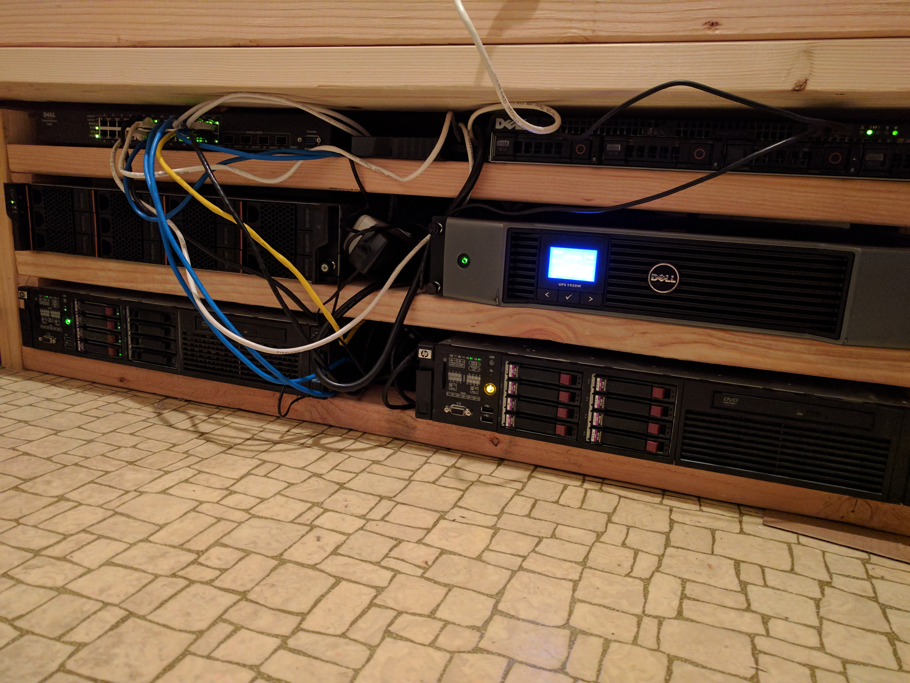
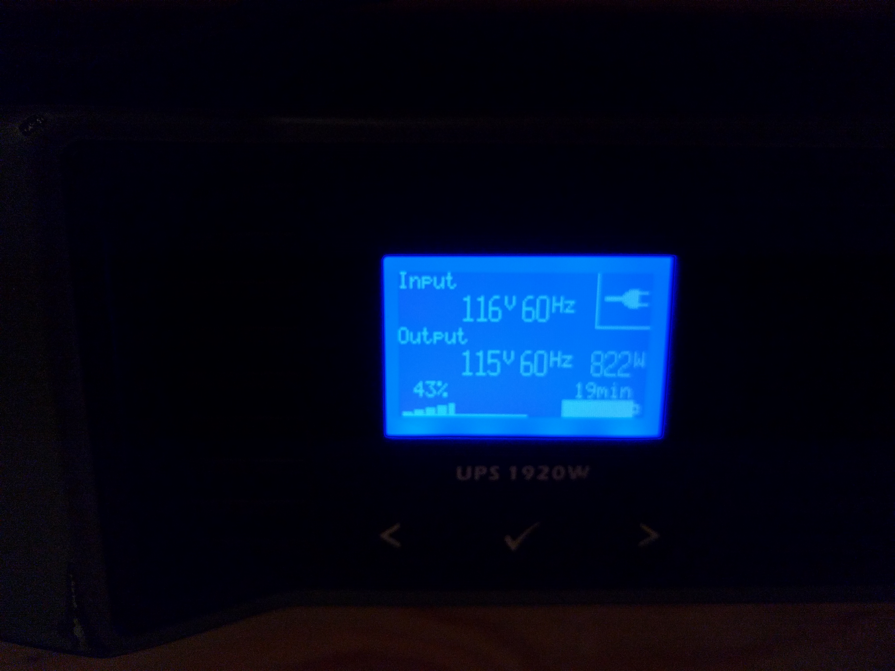
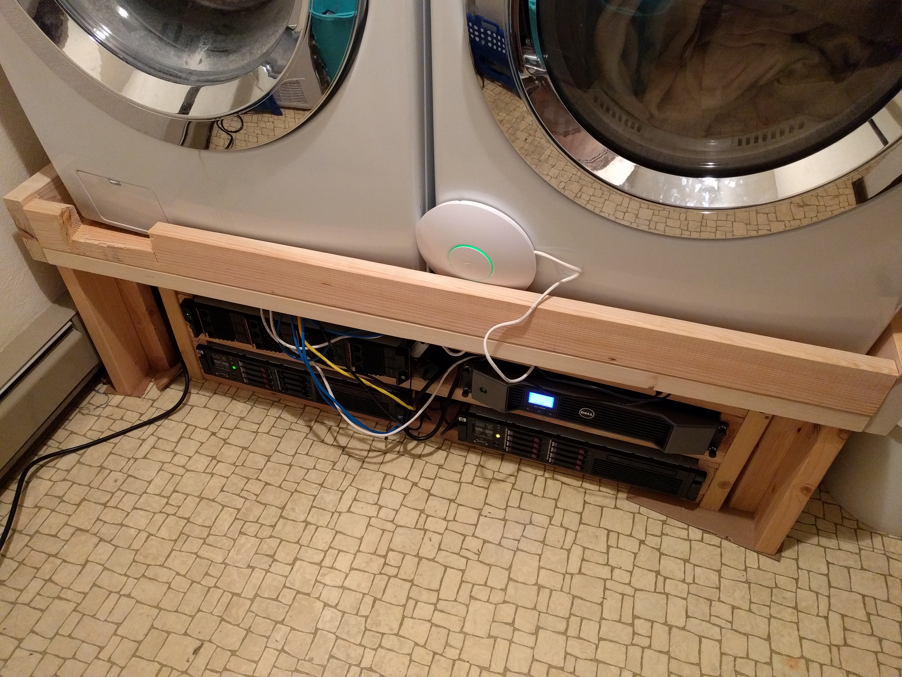
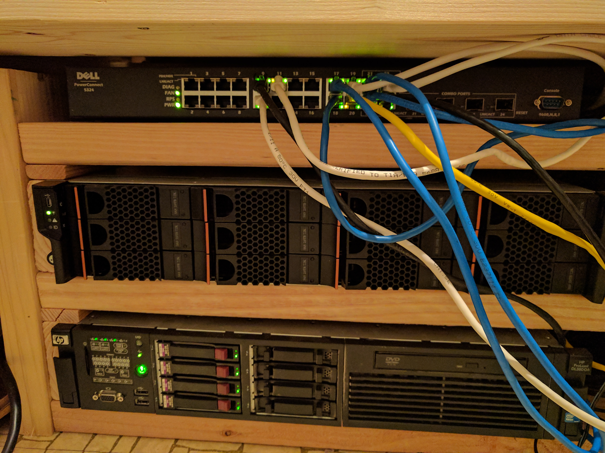
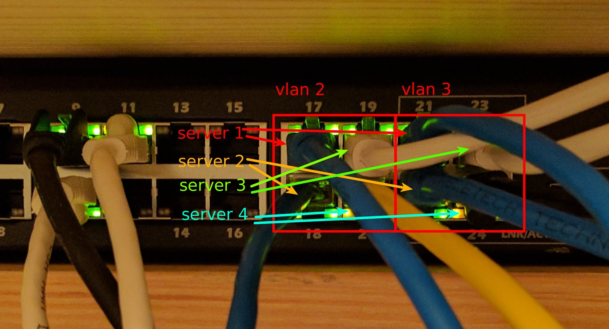
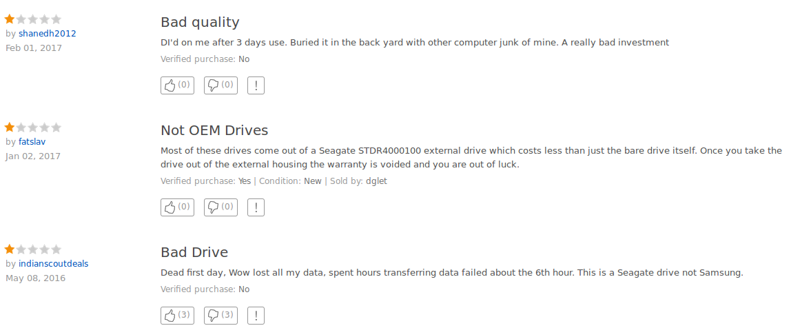

# The cheap home datacenter


It's difficult to be cold in our laundry room.

About few years ago I searched for "rackmount servers" on ebay, mostly out of
curiosity. I was surprised to find that you can get a used server for next to
nothing; in short order I found an HP unit with 12 Xeons, 144GB of memory, and
four 300GB disks for $500 + $70 shipping. Thus began the Cheap Home Datacenter,
which has now become a formidable space heating apparatus and provides the
compute resources for all of my projects. It also runs our internal Gitlab
server and continuous integration.

## What's happened since initially writing this
Some sysops adventures and questionable software:

- [Recovering the NFS server from water damage, and making it more water
  resistant](soggy-backplane.md)
- [Deploying a bunch of open-source services](open-infrastructure.md)
- [Hacky DIY monitoring](https://github.com/spencertipping/hesdeadjim)
- [Hacky DIY remote configuration](https://github.com/spencertipping/motley)

Some data science adventures and questionable software:

- [Rendering all of OpenStreetMap](osm-animation.md)
- [Visualizing all of SRTM-1 global elevation](srtm.md)

## Specs + cost
Here are all the major components (mostly servers):

Server | CPUs              | Memory | Disks   | Cost with shipping
-------|-------------------|--------|---------|-------------------
1      | 12HT (24 logical) | 144GB  | 4x300GB | $570
2      | 12                | 64GB   | 8x72GB  | $230
3      | 8HT (16 logical)  | 16GB   | 12x2TB  | $580
4      | 8                 | 24GB   | 4x3TB   | $330

The UPS is a used Dell 1920W I got for $220 shipped, and the network switch is
a Dell PowerConnect 5324 that ran about $80 when I got it a few years ago (now
they're about $50 on ebay). I built the rack from about $10 of 2x4s -- so the
total hardware cost here is $2020, maybe $2100 if you count cables.

## Why run your own servers when there's stuff like EC2?
Two big reasons. First, the learning experience. If you rent an EC2 instance
(which I also do), Amazon takes care of sysops for you -- but where's the fun
in that? Running your own servers means you're thinking about amps, cooling,
cable organization, RAID controllers, network performance, and where to buy
hard drives.

Second, it's _much_ cheaper than EC2 for the specs, even including power. I'm
running servers 1, 3, and 4 right now and the UPS is showing 822W of output.



At $0.17/kWh, that comes to:

```sh
$ units -t '822W * 0.17USD/(kW*hour)' USD/month
102.07789
```

That sounds like a lot, but EC2 prices for similar hardware are much higher per
hour. Anything with >100GB of memory is over $1. If you ran the `r4.4xlarge`,
the cheapest >100GB machine, for a month you'd have enough to buy your own
server:

```sh
$ units -t '1.064 USD/hour' USD/month
777.2354
```

That also isn't counting any data transfer costs. In addition to the Amazon
data-out $0.10/GB, I found out that CenturyLink (and most ISPs most likely) is
very unhappy if you download 2TB of data in a month. So I can't treat a remote
server as being similarly available even though my connection bandwidth is
theoretically high enough.

## Practical considerations: power, heat, and noise
There are two issues around power:

1. Residential power isn't especially reliable -- we probably get three or four
   multi-second outages per year, plus weird voltage sags every now and then
2. If your servers share a circuit with other stuff, you could easily hit a
   breaker limit

I did a power+disk stress test on all four servers and got up to 1380W of the
1800W breaker limit, so that leaves just 3.5 amps for the washer, chest
freezer, ceiling light, and water softener that share the circuit. This means I
can't realistically build out this setup any further and I should probably
suspend CPU-heavy stuff when we're running the laundry.

If you're just running one or two servers, though, you'll probably be fine. Any
power issues you run into are probably going to be caused by [homemade chaos
monkeys](https://github.com/Netflix/SimianArmy/wiki/Chaos-Monkey).

### Dealing with heat
Servers are space heaters, and 900W is about equivalent to a 1-square-meter
skylight in full sun. Our laundry room is about 20-30F warmer than the rest of
the house, often just above 100F -- and the adjacent guest bath stays about 90F
because interior walls aren't insulated.

For the most part the heat isn't a bad situation for the servers themselves;
heat radiates proportionally to the temperature difference so the room doesn't
have runaway thermal problems. But a couple of things to keep in mind:

1. Hotspots - you want the hot air to travel as far as possible before reaching
   the intake vents (or I guess more specifically, you want it to cool down as
   much as possible by contacting walls/ceilings/etc). In my initial setup I
   had some major airflow problems that caused the server fans to run a lot
   more than they should have.
2. Cooling - if you have central AC or the server room has a lot of interior
   walls, the heat is going to radiate into your house. This can add more to
   your power bill. I didn't figure cooling costs into my setup because our
   house has a flat roof and evaporative cooling (which is about 1/10th the
   power usage of refrigerated air, but only works in the desert).

It's also worth considering that server fans use a nontrivial amount of wattage
themselves; one of the servers has six 12V, 3.4A fans -- theoretically a
maximum of just over 200W output. So fans running at high speeds will
_increase_ the total heat output of a server, possibly by a double-digit
percentage.

### Dealing with noise
The main compute server is an HP DL380 G6, and it's mostly silent unless the
fans are running. Once they are, there are about ten different levels -- but
the ones near the top are serious business; I just measured the noise levels at
78dBA using a free app that [might be reasonably
accurate](https://blogs.cdc.gov/niosh-science-blog/2014/04/09/sound-apps/).

So although it's not to the level of causing hearing loss, you don't want a
server running in your living room. Having it behind one closed door drops the
noise to ~48dB and behind two closed doors it's nearly inaudible at ~27dB.

### Space
Rackmount stuff isn't small, but it is flat. All of the equipment fits in about
14" of vertical room under the laundry machines, and that's including a fairly
inefficient rack that adds 2" of overhead per 2U device:



It's a tight fit though. No more room for anything, including the wifi access
point (which is why it's hanging out with the dryer):



It would be possible to get another 2U of space on each side by using thinner
racking, but in my case power + heat would make that impractical -- and the
rack would also be more expensive to build since it probably couldn't be made
out of wood.

## Configuring stuff
### Bonding for 2Gbps network on gigabit hardware
You can't get 2x throughput on bonded links using an unmanaged gigabit switch,
and you probably don't want to live with 125MB/s NFS IO. To get 250MB/s you
need either two unmanaged switches or one managed switch with vlan support.
[This
post](http://louwrentius.com/achieving-450-mbs-network-file-transfers-using-linux-bonding.html)
explains the technique involved. Here's the configuration I'm using:

#### `/etc/modules`
You have to load the `bonding` module or nothing will work. Found this out the
hard way.

```sh
# /etc/modules: kernel modules to load at boot time.
#
# This file contains the names of kernel modules that should be loaded
# at boot time, one per line. Lines beginning with "#" are ignored.

bonding
```

#### `/etc/network/interfaces`
This is verbatim from one of the servers. Server 1, the compute server, runs a
NAT (linked below) and has address `10.35.0.2`, so everything on the 10.X
network uses it as a gateway. Any connections going the other way are done with
[sshuttle](https://github.com/apenwarr/sshuttle).

```sh
# This file describes the network interfaces available on your system
# and how to activate them. For more information, see interfaces(5).

source /etc/network/interfaces.d/*

# The loopback network interface
auto lo
iface lo inet loopback

# The primary network interface
auto enp2s0
iface enp2s0 inet manual
bond-master bond0

auto enp3s0
iface enp3s0 inet manual
bond-master bond0

auto bond0
iface bond0 inet static
address 10.35.0.4
netmask 255.255.0.0
gateway 10.35.0.2
dns-nameservers 8.8.8.8 8.8.4.4
bond-mode 0
bond-miimon 100
bond-slaves enp2s0 enp3s0
```

#### NAT for the gateway server
This is a script that gets run when the server boots up:

```sh
#!/bin/bash
# Sets up NAT from the 10.35.0.0/16 network.
# Usage: sudo ./nat

sysctl sys.net.ipv4.ip_forward=1

iptables -t nat -A POSTROUTING -o enp4s0f0 -j MASQUERADE
iptables -A FORWARD -i enp4s0f0 -o bond0 \
         -m state --state RELATED,ESTABLISHED -j ACCEPT
iptables -A FORWARD -i bond0 -o enp4s0f0 -j ACCEPT
```

The idea here is that there are three interfaces on the gateway, two bonded to
`bond0` and one on the 192.168 network. As far as I know you can't have a
gateway server using the bonding setup if you just have two network interfaces.

#### Switch configuration
I used a USB-serial connector to configure the switch; once that's plugged in
you should be able to run `screen /dev/ttyUSB0 9600` or similar to log into the
console. Here's the section of configuration that sets up vlans:

```
> show running-config
...
vlan database
vlan 2-3
exit
interface range ethernet g(17-20)
switchport access vlan 2
exit
interface range ethernet g(21-24)
switchport access vlan 3
exit
arp timeout 60
...
```

This creates two square 2x2 blocks on the front:



### TODO: more stuff
I'm trying to think of other configuration that wasn't obvious when I was doing
the server setup:

- RAID configuration (server 3 runs a 20TB RAID6 volume)
- NFS -- surprisingly straightforward except for `no_root_squash`
- The same-subnet ARP reply issue (on Linux, interfaces will reply to ARP
  requests for same-subnet IP addresses they don't own)
- Docker
- Gitlab + CI (which is awesome!)

There's probably more; I'll write these up as I think of them.

# Appendix: notes from the original writeup
A drive failed as I was writing up the original version of this post, so I got
some more hardware and did some overdue maintenance like racking the servers.
Original post snippets below, including stuff like cost estimates for various
sizes of hard drives.

## Procuring the hardware
There are a surprising number of rackmount servers on ebay all the time; I
probably spent a couple of weeks total intermittently scouting for my two
servers. The one I mentioned above is mostly for compute, and the second one is
for storage; I got it for $330 shipped and it came with 4x 3TB drives.

**Uh oh:** Literally just a few minutes ago the power flickered (first time
this year) and I lost one of the external RAID-5 drives -- a Seagate 4TB that
was less than a year old I think. Everything still works but I'm running on a
degraded array, so I might as well fix this by getting a proper storage server
and offloading the data. I'm gonna hijack the narrative since I'm not yet sure
what to do next.

Also, quick aside since my compute job got killed: the server uses 138W idle so
the baseline cost is $17.13/month.

### Recovery time: fixing the storage situation
Right now I've got the following:

- The compute server: 4x 2.5" 300GB drives
- The storage server: 4x 3.5" 3TB drives
- The (now degraded) RAID5 array: 3x (now 2x) 4TB USB drives

The two servers are linked by a bonded 2xGbit connection running NFS and gets
about 240MB/s. I would add more links, but the storage server just has two.

The RAID array was built from random disks we had lying around and holds
backups of things since it's about 10x slower than everything else. It's been
on my todo list to get a real storage server instead of using the MacGyver
solution, but until now I haven't had a good reason. Now any disk failure means
real data loss -- so time to head over to ebay.

#### The options
Storage servers tend to come in a few different configurations:

- Lots of 2.5" bays: cheaper and lower power
- Lots of 3.5" bays: expensive, and a lot of these have backplanes limited to
  2TB drives
- Not very many bays: like my current storage server -- the problem with these
  is that RAID-5 or RAID-6 is inefficient, and proportionally a lot of the
  power ends up going to the CPU and non-disk stuff.

Two big questions right now:

1. What's the total cost of ownership of a 2.5" drive vs a 3.5" drive?
2. How long does it take for the extra power of 2x 2TB 3.5" drives to catch up
   to the price premium of 1x 3TB or 1x 4TB?

Some basic price points for new hard drives (I assume used isn't worth the
reliability loss, though I have no data to back that up):

- 2TB 3.5" Hitachi = $50, ~8W (6W idle according to [this article](http://www.tomshardware.com/forum/267776-32-hard-drive-power-consumption))
- 3TB 3.5" Hitachi = $70, ~8W
- 4TB 3.5" Hitachi = $115, ~8W

- 2TB 2.5" Seagate = $76, ~4W
- 3TB 2.5" Seagate = $140, ~4W?
- 4TB 2.5" Seagate = $115, ~3.5W

The 2.5" drives tend to be for laptops, but they should work fine for servers.
The reviews are pretty sketchy, though:



Before I dig around for a more reputable source of 2.5" drives, let's talk
about power cost for 3.5" units. Here are some configurations and costs,
assuming $0.17/kWh and a 2% annual drive failure rate:

- 24TB net RAID-6:  8x 3.5" 4TB = 64W  = $920 + ($7.94  power + $2.19 fail)/mo
- 24TB net RAID-6: 10x 3.5" 3TB = 80W  = $700 + ($9.93  power + $1.67 fail)/mo
- 24TB net RAID-6: 14x 3.5" 2TB = 112W = $700 + ($13.91 power + $1.67 fail)/mo

The 2TB configuration appears to make no sense since it carries a $2/TB/year
power cost, but a 2TB-limited 36 bay SuperMicro server is $435 shipped whereas
a similar unit with an unlimited backplane goes for about $1040. That $600
covers 12 years of the extra power at 24TB, ~6 years at 48TB.

**Update:** Just found a 12x3.5" 2TB server for $580 with free shipping --
that's cheaper than the baseline cost of the drives, although they're used and
some might not work. It's a decent deal whether or not the drives are in good
shape. ...so once that gets in, this writeup might change a bit.
