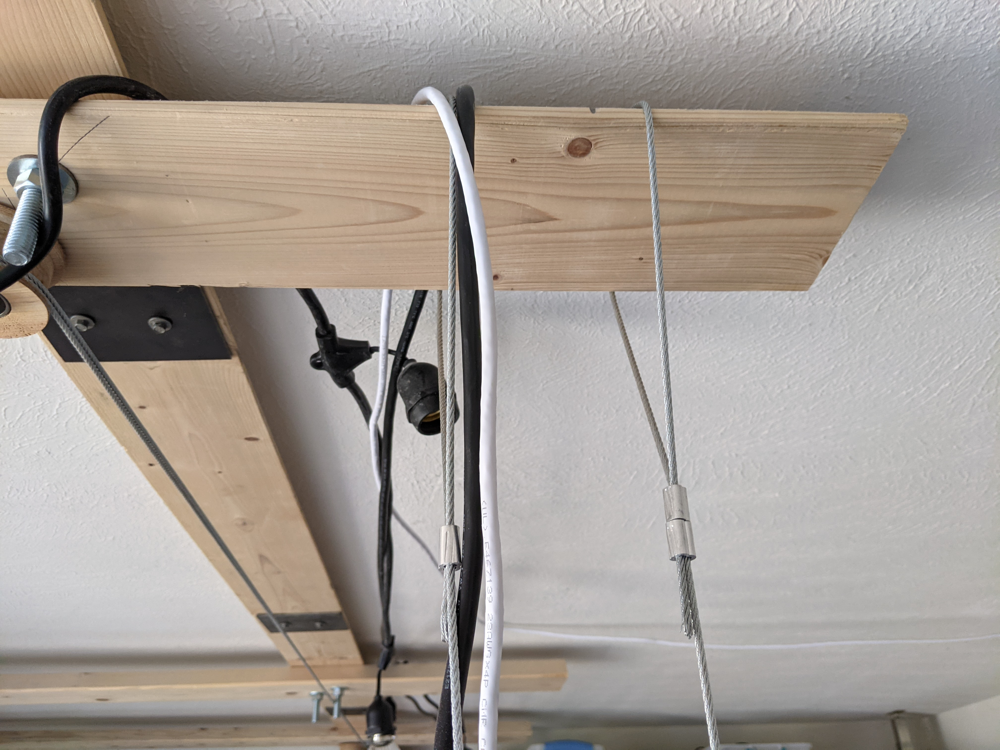

# Desk
Like many good projects, this one began two years ago in the garbage. My neighbor had found an old door leaning being thrown away outside a local business, texted me, and in short order I had a formidable solid-core wooden door sitting in my garage awaiting a purpose.

"Dumpster" and "destiny" look vaguely similar if you have really bad eyesight. I'm sure that's not a coincidence -- and if it is, it's up to people with exceptional taste to change that.

## The finished product
Here's the front view:

...and it has a wing off to the side to form an L shape:

## Design
Normally I'd write a new programming language to design a project like this, but I was in a hurry so I just used stock Blender. Later I wrote [BlendScript](https://github.com/spencertipping/blendscript) to redesign the garage.

Here's the final design, which includes all of the pulley mechanics for the storage shelf/rowing machine, whiteboards and cleats, shelving, and an early version of the desk (which I ended up designing separately using BlendScript):

This wasn't my first design at all. I had initially intended a much lamer two-level desk that didn't hang from anything:

## Suspension cables
This desk is a bit strange in that it hangs from the ceiling and doesn't touch the ground or walls.

If you're wondering, it absolutely does swing. Joyce finds it very disorienting. I think it's kinda cool, although I admit it serves no practical purpose. The desk is so heavy that you can bump into it without disturbing anything on top, including a glass of water.

In order to do this, I had to first mount a large rack to the ceiling joists. We have flat roofs in New Mexico, so the joists are the same as the roof structure -- which means snow-load ratings apply here. That's useful because it gives me a sense for how much weight I can expect them to hold before they collapse.

Incidentally, our Farm Bureau agent was very clear about our homeowner's policy covering misfortune due to poor decisions like this one. Maybe farmers are accident-prone.

Anyway, here's what the ceiling rack looks like:

I don't know what the weight limit is for the rack, but I've put about 500lbs on it with no issues. It's lagged to four different ceiling joists with a total of 16 5" bolts, each fit through a black metal plate (shown) to spread the load across the 2x6. Then there are two diagonally-mounted 1/2 x 5" carriage bolts on the corners. (Two so I can mount accessories one bolt at a time and not lose cross-beam support.)

I planned some overhang into the design; that's where one of the corner cables goes.

This cable also supports the vertical monitor; I used an angle grinder to modify its stand bracket to accept 1/8" cable.

The cables terminate in long bolts drilled into the door end-wise.

This design works and seems sturdy, but I have some mixed feelings about it. The bolts aren't very thick and I suspect they'll compress channels into the particle board over time, which could put more bending load (as opposed to shear load) on the bolts than I want. At some point I want to replace these fixed cables with a pulley system that raises the desk to the ceiling, so I figure if something goes sideways that'll be my motivation to do it. That's not a figure of speech, by the way: if anything fails, this desk and its contents will literally go sideways.

Also notice my excellent cable crimping style. Turns out you can get a passable crimp sometimes with locking pliers and determination, and you can get a very nice crimp every time with the tool you're supposed to use for crimping. Same tradeoff if you want to cut the cable: barely doable and awkward with heavy-duty _non-levered_ side cutters, a complete breeze with the dedicated cable-cutting tool. I highly recommend getting a cheap set of cable tools if you want to do a project like this.

The middle cable is similar, but looped permanently around the ceiling rack:

## The laptop shelf
The desk is a good height and comfortable to work with while standing, but it's too low if you're using a laptop. So I built a little tensegrity platform and screwed some spare rack slides to it. Here's the platform from the top:

...and here's the bolt-and-cable structure it has on each side to support it:

After tightening the rods the shelf is surprisingly rigid; it has very little give in any direction.

Initially I put laptops straight onto the wood, but I had some old rack slides lying around and wanted to improve it a bit. Rack slides are great because they extend, so I can run them out to support three machines or collapse the ends like this:

## The underside
No sense in wasting space. I've mounted a bunch of stuff to the underside of the desk, mostly with clamps. The biggest exception is the MIDI controller shelf, which is a cantilevered board with a through-bolt to the top. I don't love the bolt sticking out, but it's not terrible considering that the shelf is about four feet long. (And the rigidity is so-so; it's definitely got some bounce to it.)

Here's the full list of what's going on below the main desk:

+ 5x 6-plug power strips, all daisy-chained
+ ThinkPad X250 to power the vertical monitor (mouse and keyboard are wireless)
+ 36TB of hard drives mounted as RAID-0 on the thinkpad
+ 8-port gigabit switch (the desk has a gigabit cable to a home-central switch, routed alongside its main power)
+ Wifi access point
+ Aforementioned MIDI controller shelf
+ Two more rack slide parts to make a tablet-charging shelf
+ A signal generator
+ Not quite enough USB ports for everything

The whole desk is UPS-protected from a single 1500W unit that covers most of the room. Even though all of the computers have batteries, I had to put one in once I set up the RAID array; any power disruption and the array would need to be rebuilt. As a side benefit, now I can see how much power I'm using:

