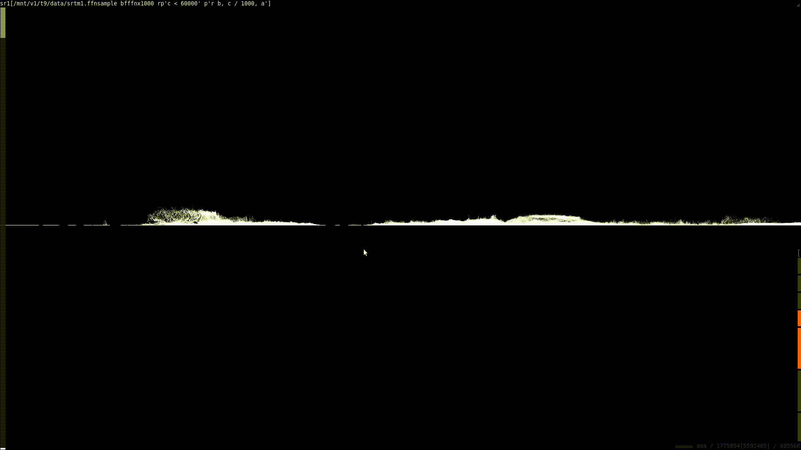
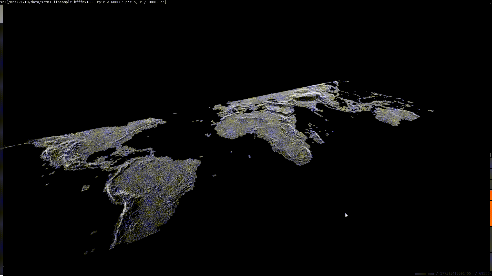
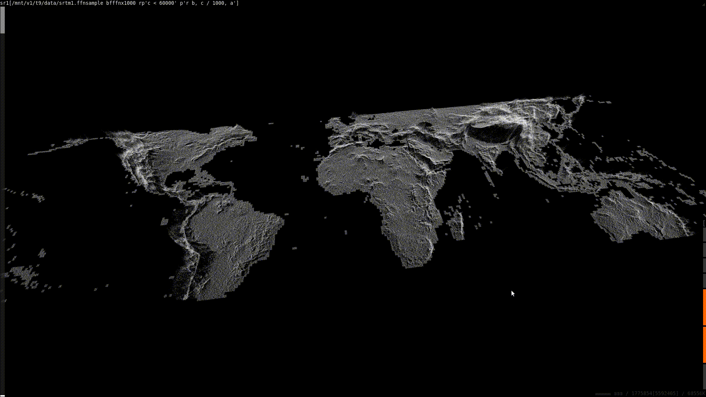
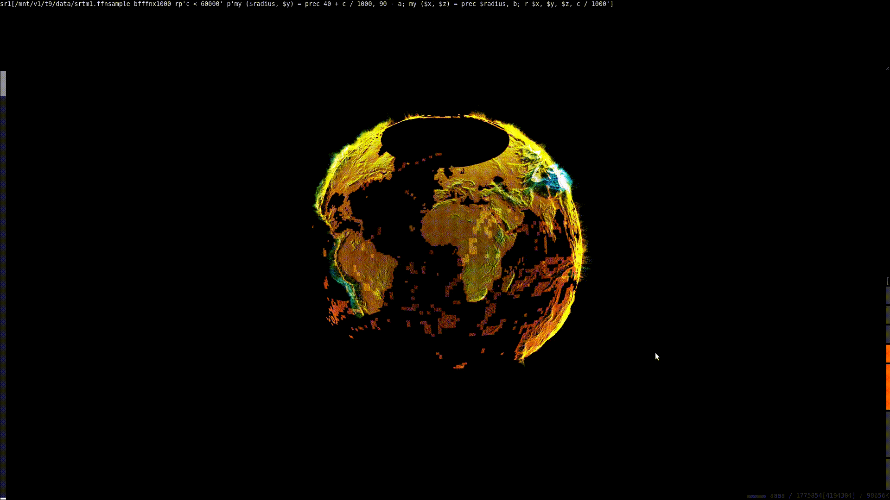

# Visualizing global elevation
SRTM tiles are encoded in a very simple format; for the SRTM1 (one arc-second
per sample) dataset, this is just a 3601x3601 list of big-endian signed short
integers. We can use ni's binary operators to convert this to a format that's
easier to use, then `ni --js` to visualize.

The first order of business is data conversion.

## Unpacking a single tile
[ni](https://github.com/spencertipping/ni) provides the `bf` operator to unpack
a fixed-width `pack` template. We can use that to unpack the binary files into
rows of heights in TSV:

```sh
$ ni srtm1/N35W106.hgt bfn3601 Y r10
0       0       1821
0       1       1819
0       2       1816
0       3       1811
0       4       1806
0       5       1803
0       6       1804
0       7       1806
0       8       1806
0       9       1805
```

The challenging part from here is making the coordinates consistent if we want
to look at multiple tiles.

## Combining everything across tiles
Rather than combining stuff, we just need to convert each tile into a sparse
form that includes absolute lat/lng coordinates for each height sample. We can
use `f[]` to drop the tile name (which contains its base coordinates) into a
pipeline.

```sh
$ ni srtm1 f[%x : i%x] r10
srtm1/N00E006.hgt
srtm1/N00E009.hgt
srtm1/N00E010.hgt
srtm1/N00E011.hgt
srtm1/N00E012.hgt
srtm1/N00E013.hgt
srtm1/N00E014.hgt
srtm1/N00E015.hgt
srtm1/N00E016.hgt
srtm1/N00E017.hgt
```

Before we get into processing stuff, it's worth designing an output format that
isn't going to be horribly inefficient. For example, we could emit (lat, lng,
elevation) tuples -- but even in binary that's going to be 5x larger than the
original data. A better approach is to simply build up tables of (lat, lng,
3600-elevations), where the elevations proceed eastwards as they do in the
original data. Queries are relatively straightforward and the size doesn't
increase much at all since we're still emitting binary.

```sh
$ ni srtm1 f[%x : i%x \< \
       bp'^{($lats, $lat, $lngs, $lng) = q{%x} =~ /([NS])(\d+)([WE])(\d+)/;
            $lat *= -1 if $lats eq "S";
            $lng *= -1 if $lngs eq "W"}
          wp "ffn3600", $lat - bi/2/(3601**2), $lng, rp"n3601"'] \
     z4\>srtm1.ffn3600
```

Now let's visualize the whole globe. `ni --js` can hold about 5M points in
memory, so let's figure out a reasonable scaling factor:

```sh
$ units -t '5million/(3600*3600*360*180)' 1/1000
0.0059537418
```

This is enough of a reduction that preprocessing makes sense. Here's the basic
idea:

- `bf'ffn3600'` to unpack the format into a single row of `lat lng pts...`
- `YC` to sparsify the heights; now we have `lat lng row col height`
- `p'r a, b+d/3600, e'` to get correct `lat lng height`

We can scale `YCp...` because each row out of `bf` is independent. I'm also
going to export 1/1000th of the data instead of the ridiculously small fraction
we had above. I'll also encode this as `ffn` binary again to save space. It's ok
(and necessary) to use full coordinates per point because we're working with a
sparse representation.

I'm also going to use gzip instead of lz4 here. LZ4 generally gets its advantage
from repeated pieces of data, whereas gzip also includes a Huffman stage that
should get a bit of leverage from the common-ranged values (maybe from the
sign/exponent bits in the floats).

The other thing is that ni's `bf` unpacker can't saturate LZ4's output speed,
nor even gzip's as far as I know.

```sh
$ ni srtm1.ffn3600 bf'ffn3600' S24YCr.001p'r a, b+d/3600, e' \
     p'wp "ffn", F_' z\>srtm1.ffnsample
```

Awesome. Now we're ready to use `ni --js` and take a look.

## Visualizing this dataset
The `ffnsample` data is very easy to work with; it's pretty much already in a
form `ni --js` can consume. Let's load it up directly, skipping most datapoints
by using `x1000` (each `ffn` tuple is 10 bytes long, so we're grabbing just
under 1%):

```sh
$ ni --js
http://localhost:8090/                  # open this in a browser
```

Here's the command I'm using in the top bar:

```
srtm1.ffnsample bf'ffnx1000'
```


We can see some continental outlines, and a bunch of elevation proceeding into
the screen (+Z axis). Let's do a few things:

1. Scale down the elevations so they're easier to work with
2. Swap latitude and longitude
3. Use `ni --js`'s X and Z axes for longitude and latitude, Y for elevation
4. Remove invalid elevations (>= 60000 meters)

Here's how each step works:

1. Elevation is in field `c` and has range [0..10000] for most of the planet, so
   `p'r a, b, c / 1000'` should do it. We can apply more scaling in the UI.
2. `a` is latitude and `b` is longitude, so: `p'r b, a, c / 1000'`.
3. Swapping Y and Z: `p'r b, c / 1000, a'`
4. We can prepend a filter: `rp'c < 60000' p'r b, c / 1000, a'`

The new top bar command:

```
srtm1.ffnsample bf'ffnx1000' rp'c < 60000' p'r b, c / 1000, a'
```

Using shift-drag to rotate the view into position:



### Exploring the dataset
We can change the axis scaling in realtime to examine elevations in more detail:



We can also highlight high-elevation regions in a couple of ways, both involving
axis mapping. `ni --js` has five input channels, four of which are mapped by
default (`A` = X, `B` = Y, `C` = Z, `D` = chroma, `E` = opacity). We can map
input field `B` to chroma or opacity to add a dimension to elevation:



### Constructing a globe
...because why not.

We can use `prec(rho, theta)` to convert from polar to rectangular coordinates.
In this case we have two dimensions to convert; let's start with latitude to go
from spherical to cylindrical, then to cubic. I'm adding a baseline elevation so
we have a sphere instead of a point; and I'm also exporting the un-transformed
elevation as a fourth channel so we can map it to opacity.

```pl
my ($radius, $y) = prec 40 + c / 1000, 90 - a;  # a = latitude, c = elevation
my ($x, $z) = prec $radius, b;                  # b = longitude
r $x, $y, $z, c / 1000;
```


