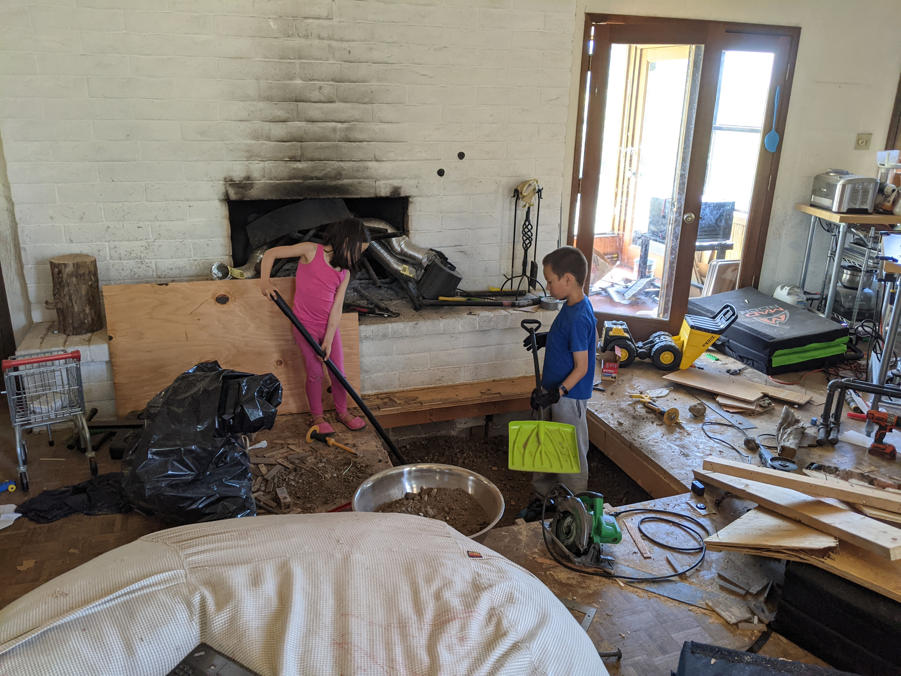
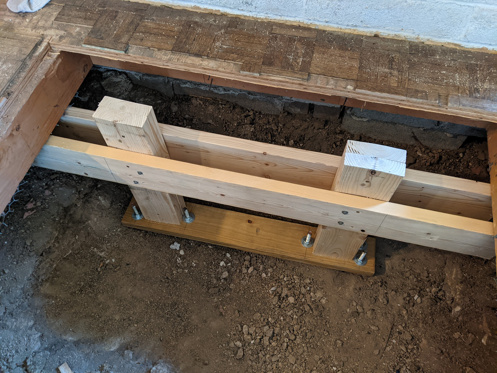

# Subterranean datacenter, part 1
Our living room floor has parquet tile. Although quite nice in many ways, the color wasn't quite to my preference.

## Ye Olde Datacenter
Prior to my interior decoration initiative, our servers had lived in the garage mounted to two vertical 2x6s that served as a flat rack. I had used a jigsaw to cut server-sized grooves, then fixed the machines in place with some steel wire. This way the servers would have unimpeded airflow.

However, there were two noticeable suboptimalities. One was that the fans would often run at full tilt, probably due to the unfavorable thermal profile:

(The 133F bar at the top of the image is fluorescent lighting, not actual heat from outside.)

The external hard drive array was also not operating in ideal conditions:

The second problem is that our garage is detached, so all connections ran over a powerline adapter that ran somewhere between 20Mbps and 50Mbps.

Also, I think our UPS had spiders.

## Moving servers underground, excavation part 1
Before beginning any construction project, I find it helpful to go through a basic checklist of prerequisites:

+ [x] Circular saw
+ [x] Sunglasses
+ [x] Noise-cancelling earbuds
+ [x] COVID mask
+ [x] Pajamas
+ [x] Tailored shirt

Also, here's a nail that was cut in half, which I thought was kinda cool:

Homes in our neighborhood are built on rocks, and ours is no exception. That's ideal for this type of project because there's little risk that minor excavation will disturb the foundation. The initial crawlspace dimensions would have supported only 2U of rack space beneath the joists, so the kids and I dug an additional 16", removing about a half ton of rocks and earth.

This happened in two stages. First with basic hand tools and child labor:

But we quickly hit rocks that were very difficult to get through. Even Putin Mode with a hammer and chisel yielded only 4" in a whole afternoon of work:

By the end of the day we still had a foot to go.

## Excavation part 2
When in doubt, check Amazon -- where jackhammers are $189 and have prime shipping.

Armed with my new implement of destruction, I quickly proceeded to delegate the work to my two year old.

She couldn't lift it though, and doesn't speak any human language, so I gave it to a different offspring instead. (He's not wearing eye protection yet because this was a practice run without the tool plugged in.)

The aforementioned two-year-old found a new way to help: carrying the rock pieces outside after we had dug them up.

She was also a huge fan once the job was done.

## Electrical
I wasn't sad to see the original floor outlet go. It had a confidence-inspiring looseness and an open ground. I un-wired it and used the supply wire for a new outlet and junction box.

Adam gave the old outlet a proper funeral by eyeballing the measurements and cutting some scrap parquet tile to cover the original, now disconnected, junction box.

## Fixing the floor joists
The old floor was not very sturdy. There's a spot not too far from the datacenter where the floor creaks and flexes (maybe 1/4" travel) if you step on it, and once we opened it up it became clear why this happened.

I don't have a detailed photo of this, but you can see what's going on in this picture:

(The light-colored 2x6s weren't there before this project.)

If you look at the original wood, you'll see the floor joist (right side) intersecting the rim joist (top). What you **don't** see, however, is a joist hanger to support it. Whoever built the original floor just used three end-nails to carry the load, which is terrible and resulted in the joist sagging about a quarter inch before I forced it up with the new frame.

Getting to the rim joist was awkward, and for other reasons I'll describe in a moment I wanted to build a new structure tied straight to the ground below. Here's the new floor support:

The joist support rests on rocks, so I machined some anchor points into the end of some 5/8" threaded rod:

The other end had some milled flats so I could rotate the rods from the top to post-tension the support:

And here are the anchors mounted in the support frame:

Next up was to put the support in place without any tension; from there I used a crescent wrench and channellocks to screw the anchors downwards from the top, compressing the rock and preventing any lateral motion. It didn't take long before I had pushed the floor joist back up to its original position, and the floor on both sides felt much more rigid than it had initially.

## Server mounts
I have plans for a more proper rack with cable-lift-to-exhume later on, but for now I wanted to build a quick makeshift rack and move the servers to their new home.

I mentioned above that I didn't want to involve the rim joist in this project. One of the big reasons is that I don't want any vibrations from the floor transferring to the servers. If you look at the design here, there are rock anchors on both sides of each of the two vertical posts; the middle section should be more or less vibration-free. The servers are effectively anchored straight to the ground.

Each shelf segment is supported on the other side by some rocks stuffed underneath. This is fine since servers don't move much when running.

Final check with a spare machine before I move the live ones:

## The migration
I normally keep the servers going for years at a time, so I upgraded them all to 20.04 LTS before powering them down. That went uneventfully.

Once I undid all the cabling and brought them inside, I opened everything up and vacuumed the dust. Amazingly, the bottom server was more or less pristine:

The only casualty was a small spider:

After some cursory cleaning/inspection I closed up the server and put it onto the new shelf, using four parquet tiles as spacing for the next one.

Cleaning out all dozen drives in the RAID array took some time, and one of them failed during the move. (This is why we run RAID-6 and keep spares on hand.)

The topmost garage server had fared the worst, probably because it was in the hottest position and ran its fans more than the others. That said, it was still in better shape than I expected any of them to be.

Got everything hooked back up, downloaded the latest [k3s](https://k3s.io), and our services came back online.

## New floor
Both the server racking and the floor are at this point temporary, but I wanted something strong enough to not be a hazard. I also wanted to support the newly-unsupported bit of original floor on the far side of the room.

Load testing to verify (it's rock-solid):

Some OSB fit to the hole and it's ready for the real load test:

## New thermal profile
The intake temperature for the last 12 hours has been between 70F and 82F, which is amazing. It no doubt helps that the servers are right under the evaporative cooler vent, but they also dissipate their heat broadly into the crawlspace.

Here are some of the thermal photos I took while the floor was still open:

...and here's what it looks like with the new floor installed. These are from early this morning, so the AC was powered off and the ambient house temperature was about 65F.

## To be continued
I like a lot about this setup; it's barely audible, the thermals seem solid, physical security is quite good, and I have eight more amps available on the garage circuit.

Access is worse. Although opening the floor is easy enough, the space is awkward to work in, and if a server needs maintenance it's a production to get to it. (Hot-swap front drives remain the best thing ever.)

Ideally I think I want the servers to lift out of the ground on a cable-pulley setup, possibly lifting the floor with them. That would make it easier to use a more conventional rack design where each machine could slide forwards for maintenance.

I had originally intended to build more than 8U capacity into this datacenter, but realistically that's about all we can run on a single 15-amp circuit. If I build another one of these, I'll cannibalize a 220V baseboard heater supply to get more capacity. But at that point I'll probably have to install a dedicated evaporative cooler in the crawlspace to vent the heat. I may need some makeshift ducting to prevent it from rising into the house (or, during the wintertime, encouraging it to).

So stay tuned for more exciting developments!
